<!-- _class: lead -->
<!-- _paginate: skip -->

# Pengantar Frontend Development<br>dan Web Design

**Bab 1** · Pintu masuk seluruh buku · Studi kasus Tokosaya

<!--
Slide pembuka sekaligus janji satu semester. Tekankan bahwa bab ini bukan cuma
daftar istilah: di akhir pertemuan, mahasiswa udah punya satu halaman HTML yang
jalan di browser. Tanyakan pembuka: "Siapa yang pernah buka DevTools tanpa
sengaja?" Jawabannya biasanya banyak, dan itu pintu masuk yang murah.
-->

---

# Tujuan Pembelajaran

Setelah menyelesaikan bab ini, kamu bisa:

- Menjelaskan definisi dan lingkup kerja *frontend development*
- Membedakan tanggung jawab frontend dan backend di sebuah website
- Menempatkan frontend dalam alur pengembangan sistem informasi
- Membedakan *web design*, UI, UX, HTML, dan CSS serta alur *design → code*
- Menulis halaman HTML pertama, menginspeksinya, dan menata folder proyek

<!--
Bacakan kelima butir dengan tempo cepat, jangan dijelaskan satu per satu sekarang.
Yang perlu ditegaskan cuma ini: butir 1 sampai 4 adalah pemahaman konsep (CPMK 1),
butir 5 adalah keterampilan yang langsung dinilai (CPMK 2) di UTS dan UAS.
Tanyakan: "Mana butir yang menurut kamu paling menakutkan?" Catat jawabannya, lalu
tunjukkan lagi di akhir pertemuan buat membandingkan.
-->

---

# Klien Berbicara Bahasa Kebutuhan

**Tokosaya** — toko online UMKM, berdiri 2019 di Jakarta, menjual aksesori dan elektronik komputer.
Tagline: **"Belanja Tepat, Kirim Cepat"**.

Selama bertahun-tahun penjualan lewat pesan singkat: pembeli menanyakan stok lewat chat, pemilik membalas satu per satu, pengiriman dicatat di buku. Usaha tetap jalan, tapi pemilik mulai kewalahan.

> "Saya ingin toko saya ada di internet, orang bisa lihat produknya, dan bisa menghubungi saya."

- Nggak ada satu pun kata HTML, CSS, *server*, atau basis data
- Yang ia sebut hanya: bisa dilihat, bisa dicari, bisa dihubungi, tetap tepercaya

<!--
Poin utama slide ini: klien SI nggak pernah berbicara dengan bahasa teknologi, dan itu
normal. Jangan biarkan mahasiswa menyimpulkan pemilik Tokosaya "kurang paham"; justru
kalimat itu adalah rumusan kebutuhan yang paling jujur. Tanyakan: "Apa yang berubah
kalau kita menerima kalimat ini apa adanya sebagai spesifikasi?" (Jawaban: nggak ada
yang bisa dikerjakan, karena kebutuhannya belum diterjemahkan.)
-->

---

<!-- _class: center -->

# Apa yang harus **tampil**, apa yang harus **tersimpan**?

Dua pertanyaan yang memisahkan pekerjaan frontend dan backend.

<!--
Interaksi lisan, jangan buka jawabannya sekarang. Gambar dua kolom di papan tulis
berlabel TAMPIL dan TERSIMPAN, lalu minta mahasiswa menyebutkan contoh dari kisah
Tokosaya. Catat semua usulan tanpa dikoreksi dulu; koreksinya menyusul di slide
soal ruang kafe dan dapur. Batas waktunya cuma dua menit, jangan sampai melebar.
-->

---

# Apa Itu *Frontend Development*

Pekerjaan membangun bagian website yang **dilihat, dibaca, dan diklik** pengguna di browser.

- *Front* — sisi depan yang menghadap pengunjung
- Tiga lapisan: **HTML** (struktur), **CSS** (tampilan), **CSS framework** (komponen)
- Contoh konkret: judul besar di atas, foto produk di tengah, tombol di bawahnya

> Frontend adalah wilayah "segala sesuatu yang tampak di layar".

<!--
Tekankan kata "pekerjaan", bukan "hobi" atau "bakat seni". Lingkup kerja inilah yang
akan dinilai klien, dan yang bikin kartu produk di Tokosaya layak atau nggak layak.
Tanyakan: "Apakah memilih kata buat tombol termasuk pekerjaan frontend?" (Jawaban:
iya, karena teks tombol dibaca dan diklik pengguna.) Salah paham yang sering muncul:
mahasiswa menganggap frontend cuma soal warna dan keindahan.
-->

---

# Batas Lingkup: yang Bukan Frontend

Buku ini adalah mata kuliah **translasi desain** — HTML dan CSS, tanpa JavaScript.

- Interaksi dinamis (keranjang bertambah) — mata kuliah pemrograman lanjutan
- Data, logika bisnis, dan basis data — wilayah backend
- Kebutuhan tampilan Tokosaya tetap terpenuhi oleh halaman statis yang baik

> Uji cepat: apakah kebutuhan ini mengubah apa yang dilihat, dibaca, atau disentuh pengguna?

<!--
Mahasiswa semester awal sering frustrasi karena merasa nggak diajari JavaScript.
Jawab jujur dan tuntas: keputusan ini disengaja, karena mata kuliah ini adalah mata
kuliah translasi desain. Ingatkan bahwa sebagian besar kebutuhan tampilan Tokosaya
(kartu produk, hero, formulir kontak, katalog) cukup dengan halaman statis.
Peringatan: jangan sampai mahasiswa menyimpulkan JavaScript nggak penting; ia cuma
ada di mata kuliah lain.
-->

---

# Frontend dan Backend: Ruang Kafe dan Dapur



> Pengunjung nggak melihat dapur, tapi tanpanya ruang kafe cuma berisi furnitur kosong.

<!--
Analogi ini akan dipakai ulang di seluruh buku, jadi pastikan tertanam. Minta satu
mahasiswa menceritakan analogi itu dengan kalimatnya sendiri sebelum kamu lanjut.
Pertanyaan pemandu: "Di kafe, siapa yang berperan sebagai pengantar pesan?"
(Jawaban: pelayan, yaitu permintaan dan respons antara browser dan server.)
Peringatan: pelayan BUKAN backend; pelayan adalah penghubung keduanya.
-->

---

# Frontend vs Backend

| Aspek | Frontend | Backend |
|---|---|---|
| Bekerja pada | Browser pengguna | Server |
| Teknologi inti | HTML, CSS, framework antarmuka | Bahasa server + basis data |
| Fokus yang diukur | Tampilan, responsif, aksesibilitas | Keandalan, keamanan, kinerja |
| Hasil yang terlihat | Kartu produk, tombol, formulir | Stok berkurang, pesanan tersimpan |
| Cara pengguna menilai | "Rapi dan mudah" | "Cepat, akurat, nggak bocor" |

<!--
Kunci pembeda yang harus dibawa keluar kelas: frontend mengurus penyajian dan
interaksi di layar, backend mengurus penyimpanan data dan aturan bisnis. Sebutkan
satu kalimat penolak miskonsepsi: frontend bukan bagian yang mudah dan backend bukan
bagian yang canggih, keduanya beda jenis tantangan. Tanyakan: "Baris mana yang
paling sulit diukur?" (Jawaban: aksesibilitas, karena nggak kasat mata.)
-->

---

# Memetakan Kebutuhan Tokosaya

| Kebutuhan klien | Kolom | Alasan singkat |
|---|---|---|
| Wujud kotak pencarian | Frontend | Bentuk, ikon, dan layoutnya |
| Menyaring ratusan produk | Backend | Aturan penyaringan di server |
| Kolom nama dan surel formulir | Frontend | Label dan susunan isian |
| Kirim isi ke halo@tokosaya.id | Backend | Pengiriman dan pencatatan |
| Stok berkurang pas tombol Beli | Backend | Penyimpanan dan aturan bisnis |
| Harga Rp650.000 pada kartu | Frontend | Penyajian data yang udah ada |

<!--
Kerjakan tabel ini bareng kelas, jangan dibacakan. Tutup kolom "Kolom" lalu minta
mahasiswa menebak tiap baris; baru buka jawabannya. Baris terakhir biasanya
memancing perdebatan: harga datang sebagai data dari server, tapi cara menulisnya di
kartu adalah kerja frontend. Tekankan pembedaan itu, karena di sini garis pemisahnya
paling kabur buat pemula.
-->

---

<!-- _class: center -->

# Think-Pair-Share: Analogi Kamu Sendiri

Cari pasangan analogi **selain** ruang kafe dan dapur buat menjelaskan frontend dan backend.

2 menit berpasangan · 2 sampai 3 pasangan berbagi

<!--
Ini Latihan Mandiri nomor 1 di buku. Contoh arah jawaban: ruang perpustakaan sebagai
frontend dan gudang buku sebagai backend. Yang dinilai bukan keindahan analoginya,
melainkan alasannya: mana yang dilihat pengguna dan mana yang menyimpan. Jangan
mengoreksi analogi mahasiswa, koreksi alasannya. Kalau nggak ada yang mau mulai,
beri satu contoh jelek dulu biar mereka berani.
-->

---

# Alur Pengembangan Sistem Informasi

Buka satu per satu; tanyakan "di tahap mana kita berada sekarang?" sebelum lanjut.

1) **Kebutuhan bisnis** — pemilik Tokosaya ingin toko yang bisa dilihat dan dihubungi
2) **Analisis** — siapa pengunjungnya dan proses apa yang mengalir sampai pesanan
3) **Desain** — layout halaman, warna, hierarki tombol
4) **Implementasi** — frontend mewujudkan rancangan; backend membangun layanan data
5) **Pengujian & pemeliharaan** — memeriksa keduanya, lalu menjaga sistem tetap hidup

<!--
Alur ini adalah tulang punggung analisis kebutuhan, jadi jalankan sebagai cerita
berurutan, bukan sebagai daftar hafalan. Tekankan bahwa urutannya nggak boleh
dibalik, dan itulah alasan buku ini menahan Bootstrap sampai Bab 9. Kesalahan umum
yang perlu dicegah: mahasiswa melompat langsung ke implementasi pas diberi tugas
kelompok, lalu bingung pas rancangannya berubah di tengah jalan.
-->

---

# Keluaran Khas Tiap Tahap

| Tahap | Pertanyaan kunci | Keluaran |
|---|---|---|
| Kebutuhan bisnis | Apa masalah yang diselesaikan? | Daftar kebutuhan utama klien |
| Analisis | Apa yang sistem harus bisa? | Spesifikasi, peran pengguna |
| Desain | Gimana tampak dan terasa? | Rancangan antarmuka, layout |
| Implementasi | Gimana rancangan dihidupkan? | Halaman HTML/CSS + layanan data |
| Pengujian & pemeliharaan | Apakah sesuai dan tetap berguna? | Catatan temuan, perbaikan rutin |

<!--
Gunakan tabel ini sebagai alat orientasi, bukan hafalan. Tanyakan: "Kamu sedang
memegang keluaran tahap apa pas menulis HTML profil mahasiswa di praktikum?"
(Jawaban: implementasi, karena rancangannya udah ditentukan.) Sebutkan contoh dari
konteks lain: sistem perpustakaan kampus, di mana tahap analisis menghasilkan
kebutuhan "peminjam harus bisa melihat status ketersediaan buku".
-->

---

# Frontend Adalah Titik Temu



> Ketajaman frontend bukan hiasan, melainkan syarat sistem informasi benar-benar dipakai.

<!--
Ini slide yang paling menjawab "kenapa saya, mahasiswa SI, belajar HTML". Ceritakan
skenario nyata: formulir tanpa label dan tombol dengan kata yang membingungkan bikin
pengguna berhenti di layar pertama, secerdas apa pun backendnya. Tanyakan: "Kalau
frontend buruk, apakah itu kesalahan desainer atau implementer?" (Jawaban: keduanya,
dan jawaban itu justru alasan satu orang memakai tiga topi di slide berikutnya.)
-->

---

# Tiga Topi di Tim Kecil

- **Analis** — mencatat apa yang klien butuhkan
- **Perancang** — menata pilihan visualnya
- **Implementer** — menuliskan HTML dan CSS

Lulusan SI berguna sejak pertemuan pertama dengan klien: mampu mendengarkan kalimat kebutuhan lalu mengubahnya jadi halaman yang bisa dilihat.

<!--
Jelaskan bahwa tim kecil adalah situasi paling umum di proyek SI di UMKM dan
lingkungan kampus, jadi tiga topi dalam satu kepala bukan pengecualian melainkan
normal. Buku ini melatih topi ketiga paling intens, tapi selalu dalam bingkai dua
topi lainnya. Tanyakan: "Topi mana yang paling sering dilupakan mahasiswa pas
mengerjakan tugas?" (Jawaban: analis, karena mereka cenderung langsung menulis kode.)
-->

---

# Empat Istilah yang Sering Tertukar

| Istilah | Lapisan | Satu kalimat pembatas |
|---|---|---|
| Web design | Kerangka besar | Merancang tampilan dan pengalaman halaman |
| UI | Elemen yang disentuh | Tombol, kartu produk, ikon keranjang, formulir |
| UX | Pengalaman menyeluruh | Perjalanan pengguna menuju tujuannya |
| HTML | Struktur | Heading, paragraf, daftar, gambar, link |
| CSS | Rupa | Warna, huruf, jarak, layout |

> UI adalah *tampaknya*, UX adalah *rasanya*, dan web design menyelaraskan keduanya.

<!--
Istilah ini dipakai sehari-hari secara bergantian, termasuk oleh dosen lain, jadi
perlu dikunci sekarang. Pertanyaan pemandu: "Kasus 'sulit menemukan tombol kontak'
itu masalah UI atau UX?" (Jawaban: keduanya, karena tombolnya ada tapi perjalanan
menemukannya yang gagal.) Ingatkan bahwa HTML dan CSS bukan istilah desain,
melainkan bahan bangun yang menghidupkan rancangan.
-->

---

# Alur Design → Code

1) **Kebutuhan** diubah jadi **rancangan** — alat desain kayak Figma (Bab 14)
2) Rancangan diuraikan menjadi **struktur** — bahasa HTML
3) Struktur diberi **rupa** — warna, ukuran, jarak, layout
4) Kalau kebutuhan berulang, pakai **komponen siap pakai** dari CSS framework

> Desain yang jelas membuat kode menemukan jalannya, bukan mencarinya sendiri.

<!--
Empat langkah ini adalah alur kerja yang akan dilatih berulang di seluruh buku, jadi
tuliskan urutannya di papan dan biarkan tertulis sampai akhir pertemuan. Tekankan
bahwa langkah pertama bukan pekerjaan mahasiswa di mata kuliah ini: Figma dibahas di
Bab 14, dan perannya di sana adalah membaca rancangan, bukan membuatnya dari nol.
Peringatan: mahasiswa cenderung melewati langkah rancangan lalu mengarang tampilan.
-->

---

# Contoh Kecil: Lencana *Best Seller*

Rancangan: lencana kecil berwarna *amber* di pojok kartu Keyboard Mekanis KX-210, teks gelap.

- **HTML** — menuliskan teks lencana pada bagian kartu yang tepat
- **CSS** — memberi latar warna, bentuk bulat, dan ukuran huruf
- **Bootstrap** — kelak menyelesaikannya dengan satu kelas `badge`

Contoh lain: kartu produk putih bersudut membulat dengan harga berwarna indigo.

<!--
Ini contoh yang paling murah buat memperlihatkan seluruh filosofi buku: rancangan →
struktur → rupa → komponen. Jalankan sebagai cerita, bukan sebagai kode. Tanyakan:
"Kalau Bootstrap menyelesaikannya dengan satu kelas, kenapa kita belajar CSS dulu?"
(Jawaban: biar tahu apa yang kelas itu lakukan dan bisa menyesuaikannya kalau
rancangan nggak mengikuti pola standar.)
-->

---

<!-- _class: center -->

# Mini Kuis: Pilih Lapisan yang Tepat

1. Klien ingin tombol kontak mudah ditemukan tanpa menggulir — frontend atau backend?
2. Tombol "Beli" ditekan dan stok benar-benar berkurang — frontend atau backend?
3. Halaman tampak menyusut di HP sampai perlu cubit-zoom — apa penyebabnya?

<!--
Beri 60 detik, minta angkat tangan buat tiap butir, jangan dibahas panjang. Kunci
ada di slide berikutnya, jadi jangan dibocorkan. Butir 3 sengaja memancing jawaban
"salah tulis CSS", padahal penyebabnya meta viewport yang belum ada di head. Ingat
jawaban yang salah itu, karena dibahas di slide tentang DevTools.
-->

---

# Kunci Mini Kuis

1. **Frontend** — kebutuhannya mengubah apa yang dilihat dan disentuh pengguna
2. **Backend** — stok berkurang berarti data tersimpan dan aturan bisnis bekerja
3. **`<meta name="viewport">` belum ada** — browser mengasumsikan lebar meja standar

> Frontend mengurus penyajian dan interaksi di layar; backend mengurus penyimpanan data dan aturan bisnis.

<!--
Ulangi sebab butir 3, karena ini kesalahan paling mahal di praktikum: mahasiswa
menghabiskan waktu mengutak-atik CSS padahal meta viewport nggak pernah ditulis.
Sebutkan rambu yang akan datang: mulai setiap dokumen dari pola lengkap yang udah
berisi charset dan viewport, jangan menulis dokumen dari nol.
-->

---

# Anatomi Sebuah Website

- **Halaman** (*page*) — satu dokumen HTML yang menampilkan satu layar konten
- **Website** — sejumlah halaman yang saling terhubung lewat link
- **Aset** — gambar, file CSS, kadang font dan ikon
- **`index.html`** — file yang dibuka pas pengunjung cuma mengetik `tokosaya.id/`

<!--
Poin yang paling sering terlewat adalah baris terakhir. Jelaskan konvensi index:
alamat tanpa nama file dianggap menunjuk halaman utama, dan konvensi yang sama
bekerja di komputer sendiri pas kita dobel klik index.html. Itulah sebabnya seluruh
proyek buku ini memakai nama index.html, bukan utama.html atau halaman1.html.
Tanyakan: "Apa jadinya folder tanpa index.html?" (Jawaban: pengunjung melihat daftar
file, bukan halaman.)
-->

---

# Pola Folder Proyek Tokosaya

| File / Folder | Peran |
|---|---|
| `index.html` | Halaman beranda |
| `katalog.html` | Daftar produk |
| `tentang.html`, `kontak.html` | Profil toko dan formulir kontak |
| `css/style.css` | Satu file gaya bersama buat semua halaman |
| `img/` | Gambar produk dan logo, semuanya berakhiran `.svg` |

Tiga kebiasaan: satu CSS bersama · nama *kebab-case* · satu halaman satu file.

<!--
Tuliskan pohon folder ini di papan dan biarkan terlihat selama praktikum. Tiga
kebiasaan itu terlihat remeh tapi punya alasan: satu CSS biar perbaikan di satu
tempat menular ke semua halaman; kebab-case biar link nggak rontok karena
perbedaan besar kecil huruf antar sistem operasi; satu file per halaman biar nggak
ada dokumen raksasa. Peringatan: spasi dan huruf kapital pada nama file adalah
sumber bug link paling umum buat pemula.
-->

---

# Domain, Hosting, dan URL

- **Domain** — nama alamat website, mis. `tokosaya.id`, disewa tahunan
- **Hosting** — layanan penyimpan file pada server yang selalu menyala
- **Deployment** — menyalin file ke server lalu mengaitkannya dengan domain
- `https` adalah skema · `tokosaya.id` adalah domain · `/katalog.html` adalah jalur file

> Link `<a href="katalog.html">` memakai **jalur relatif**: dibaca dari folder halaman yang membukanya.

<!--
Bedakan domain dan hosting dengan pertanyaan: "Mana yang berupa nama, mana yang berupa
tempat?" Domain adalah nama, hosting adalah tempat file disimpan, dan keduanya disewa
terpisah. Buat latihan bab ini, keduanya belum dibutuhkan sama sekali: file dibuka
langsung dari komputer sendiri, konsepnya sama, cuma belum dipasang di internet. Baris
terakhir penting buat Bab 2, pas link antarhalaman mulai ditulis.
-->

---

# Cara Browser Merender Halaman


> Pohon dokumen inilah yang disebut *DOM* dan yang akan kamu lihat di panel Elements.

<!--
Jelaskan keempat gerakan itu sebagai urutan yang nggak bisa ditukar, lalu minta
mahasiswa mengulanginya lisan dalam empat kata: diterima, disusun, diberi gaya,
digambar. Pemahaman umum menyebut pohon ini DOM; cukup pahami sebagai wujud struktur
dokumen di dalam browser. Tanyakan: "Pada langkah mana warna tombol ditentukan?"
(Jawaban: langkah tiga, pas aturan CSS dicocokkan ke elemen pohon.)
-->

---

# Chrome DevTools: Mengamati, Bukan Mengeksekusi

Buka dengan `F12` atau klik kanan halaman lalu pilih **Inspect**.

- **Elements** — pohon tag halaman; mengklik satu baris menyorot elemen itu di halaman
- **Device toolbar** — uji lebar layar dari HP sekitar 360 px sampai komputer meja
- Kebiasaan QA yang murah: *simpan → muat ulang → periksa* setiap kali kode berubah

> Browser nggak menebak, browser membaca. Tampilan yang salah selalu punya baris penyebabnya.

<!--
Dua kemampuan di slide ini dikategorikan sebagai pekerjaan mengamati, bukan
mengeksekusi, dan keduanya naik kelas jadi alat pengujian serius di Bab 7, 13, dan
15. Tekankan kalimat "browser membaca": ini fondasi seluruh mentalitas debugging yang
akan dipakai sampai akhir semester. Peringatan: banyak "bug" pemula sebenarnya cuma
file lama yang masih tampil karena halaman belum dimuat ulang.
-->

---

<!-- _class: center -->

# Apa yang Terjadi Jika `<meta name="viewport">` Hilang?

Jawaban dan cara melacaknya ada di slide berikutnya.

<!--
Tahan dulu, jangan dijawab sekarang. Minta mahasiswa berpasangan satu menit lalu
angkat tangan: apakah halaman jadi rusak, atau tetap tampil dengan cara yang
berbeda? Dua jawaban itu akan muncul, dan keduanya berguna buat mengoreksi. Kalau
kelas terdiam, beri petunjuk bahwa jawabannya muncul di device toolbar pas praktikum
nanti.
-->

---

# Membaca Gejala, Bukan Menebak

**Kalau viewport hilang:** halaman tetap tampil, tapi nggak mengikuti lebar layar perangkat — umumnya tampak besar dan perlu cubit-zoom.

| Keluhan klien | Yang diperiksa |
|---|---|
| "Tombolnya hilang pas dibuka dari HP" | Elemen benar ada di struktur? (Elements) |
| "Tulisannya menabrak logo" | Berapa lebar layar pengguna? (device toolbar) |
| "Masih tampil versi yang lama" | Halaman udah dimuat ulang dengan `F5`? |

<!--
Kunci dari pasangan slide ini: keluhan pengguna hampir selalu datang dalam bahasa
antarmuka, dan tugas analis SI adalah menerjemahkannya jadi daftar periksa yang bisa
dilacak. Dua pertanyaan pengubah segalanya: elemen apa yang seharusnya ada di
struktur, dan berapa lebar layar yang dipakai. Ingatkan bahwa jawaban butir ketiga
mini kuis sebelumnya ada di baris pertama slide ini.
-->

---

# HTML, CSS, dan CSS Framework

| Teknologi | Mengurus | Contoh |
|---|---|---|
| **HTML** | Struktur konten yang bermakna | Judul, paragraf, daftar, gambar, link |
| **CSS** | Rupa dan layout | Warna, huruf, jarak, susunan kolom |
| **CSS framework** | Komponen siap pakai | Bootstrap 5, masuk Bab 9 lewat CDN |

> Framework yang dipakai tanpa memahami dasarnya berubah jadi penjara.

<!--
Kalimat kunci buat slide ini adalah kutipan di bawah: tanpa memahami dasar, mahasiswa
tahu cara mengambil komponen tapi nggak tahu kenapa tampilannya begitu, nggak bisa
menyesuaikannya, dan bingung pas komponen itu merusak hal lain. Tanyakan: "Kalau
Bootstrap masuk Bab 9, apa yang membuat kita siap?" (Jawaban: udah bisa membangun
kartu produk dengan CSS murni, jadi komponen Bootstrap bukan kotak hitam lagi.)
-->

---

# Perangkat Kerja: VS Code dan Chrome

- **VS Code** — pewarnaan tag, pelengkapan otomatis pas mengetik `<`, pohon file di Explorer
- **Live Server** (opsional) — memuat ulang halaman sendiri setiap file disimpan
- **Google Chrome** — browser pilihan, dengan DevTools yang siap dipakai
- **Figma** menyusul di Bab 14; panel DevTools yang lebih dalam menyusul di Bab 13 dan 15

Kebiasaan kecil: `Ctrl+S` setiap selesai menulis · jangan mengetik kode di pengolah kata · salin folder sebelum perubahan besar.

<!--
Pesan utamanya bukan daftar alat, melainkan cara buku ini memperkenalkan alat: tepat
pas masalahnya muncul, bukan menumpuk semua alat sejak hari pertama. Pola yang sama
memandu urutan HTML, CSS, lalu Bootstrap. Sebutkan jebakan pengolah kata secara
eksplisit, karena ia menyelipkan karakter tak terlihat yang merusak file HTML dan
gejalanya sulit dilacak. Tekankan juga kebiasaan menyimpan: dua detik menyimpan bisa
menghemat berjam-jam.
-->

---

# Peta 16 Bab: Tiga Gerbang Besar

| Rentang | Fokus | Proyek |
|---|---|---|
| Bab 1 | Fondasi dan halaman HTML pertama | `profil-mahasiswa/` |
| Bab 2–7 | HTML5 semantik, CSS, box model, Flexbox, Grid | `tokosaya-css/` |
| Bab 8 | UTS — integrasi Bab 1–7 | `tokosaya-css/` |
| Bab 9–15 | Bootstrap 5, UI/UX, responsif, Figma, QA | `tokosaya-bootstrap/` |
| Bab 16 | UAS — final project pilihan kasus | Proyek utuh |

> Kalau kamu tahu sedang berada di halaman N dari peta ini, setiap jam belajar terasa sebagai satu langkah.

<!--
Slide ini ada buat menenangkan mahasiswa yang cemas menghadapi satu semester penuh.
Tunjukkan bahwa mereka cuma perlu menempuh satu langkah sekarang: satu halaman HTML.
Tanyakan: "Dari tabel ini, bab mana yang kamu duga paling menantang dan kenapa?"
Simpan jawabannya, karena Refleksi nomor 4 di buku menanyakan hal yang sama dan
mahasiswa akan membandingkan tebakannya di akhir semester.
-->

---

# Kepala Dokumen: Pola yang Tidak Pernah Berubah

`profil-mahasiswa/index.html`

```html
<!DOCTYPE html>
<html lang="id">
<head>
  <meta charset="utf-8">
  <meta name="viewport" content="width=device-width, initial-scale=1">
  <title>Profil Mahasiswa — Andi Pratama</title>
</head>
```

> Deklarasi HTML5 · bahasa dokumen · pengodean · viewport · judul tab.

<!--
Ketik ulang baris ini di depan kelas, jangan tampilkan slide jadi. Setiap baris punya
satu alasan yang bisa ditanyakan: kenapa charset wajib (biar tanda petik dan tanda
seru pada teks Indonesia nggak berubah jadi simbol aneh), kenapa viewport wajib
(fondasi seluruh pekerjaan responsif Bab 7 dan 13), dan kenapa title penting
(satu-satunya elemen head yang dilihat pengguna, muncul di tab dan riwayat).
Peringatan: jangan menulis dokumen dari nol tanpa pola lengkap ini.
-->

---

# Isi Halaman: Lima Keluarga Elemen

`profil-mahasiswa/index.html` (lanjutan)

```html
<body>
  <h1>Andi Pratama</h1>
  <p></p>
  <h2>Bidang Minat</h2>
  <ul>
    <li>Desain antarmuka web</li>
    <li>Sistem informasi manajemen</li>
  </ul>
  <h2>Keterampilan</h2>
  <ol>
    <li>Menuliskan dokumen HTML dasar</li>
  </ol>
</body>
```

<!--
Lanjutkan mengetik dari slide sebelumnya. Yang diuji di sini adalah pilihan elemen
berdasarkan makna, bukan selera: ul buat isi yang nggak mengenal urutan, ol buat isi
yang urutannya bermakna. Minta mahasiswa menilai sendiri: "Bidang Minat seharusnya ul
atau ol?" (Jawaban: ul, karena nggak ada urutan di antara minat.) Sebutkan bahwa sisa
filenya, termasuk blok Link dengan link mailto, dilanjutkan di praktikum.
-->

---

# Empat Disiplin Struktur

- Satu dokumen, satu `<h1>` — judul terpenting halaman
- Heading nggak melompat level: `h1` → `h2` → `h3`, bukan `h1` → `h3`
- Setiap gambar diberi `alt` berisi deskripsi singkat
- Semua tag ditulis dengan huruf kecil

> Keempat kebiasaan ini adalah fondasi aksesibilitas, dan diuji di Bab 8 dan Bab 16.

<!--
Kedengarannya kayak detail kecil, jadi jelaskan konsekuensinya: alt adalah satu-satunya
teks yang dibacakan pembaca layar dan yang tampil pas gambar gagal dimuat, sedangkan
lompatan level heading merusak peta dokumen bagi alat bantu. Tuliskan keempatnya di
papan sebagai daftar periksa, karena ini dipakai sebagai rubrik penilaian. Peringatan:
mahasiswa cenderung menulis alt berisi nama file, bukan deskripsi.
-->

---

# Tiga Rambu Kesalahan Pemula

1. **Jangan mengarang tag sendiri** — tag tak dikenal diabaikan tanpa pesan kesalahan
2. **Jangan menutup dokumen setengah jadi** — struktur pohon bergeser tanpa gejala
3. **Simpan sebagai `.html` dengan pengodean UTF-8** sejak penulisan pertama

> Kalau teks Indonesia tampil sebagai kotak atau tanda tanya, periksa charset dan pengodean filenya.

<!--
Ketiga rambu ini seluruhnya muncul lagi di bagian Troubleshooting pada praktikum, jadi
perkenalkan sekali di sini dan jangan diulang panjang lebar. Rambu pertama paling
penting: kekuatan HTML justru pada kumpulan elemen baku yang pengertiannya disepakati
seluruh browser, dan pelanggarannya nggak memberi pesan apa pun. Tanyakan: "Kenapa
kesalahan tag lebih sulit dilacak daripada kesalahan CSS?" (Jawaban: karena nggak ada
peringatan sama sekali, cuma tampilan yang bergeser.)
-->

---

# Praktikum: Yang Wajib Teramati

- Siapkan `profil-mahasiswa/` dengan subfolder `img/` berisi `foto-profil.png`
- Panel **Elements** memperlihatkan `html > head > meta` dan `body` berisi `h1`, `img`, `p`, `ul`/`ol`
- Mengklik baris elemen menyorot kawasan elemen itu di halaman
- **Device toolbar** menjalankan lebar dari sekitar 360 px ke layar meja, teks mengalir kembali

Catat tiga baris setiap kali DevTools dibuka: apa yang dilihat, di panel apa, apa artinya bagi kode.

<!--
Ini slide yang menyambungkan teori penuh di depan dengan praktikum. Tekankan bahwa
pengamatan yang dicatat lebih bernilai daripada pengamatan yang cuma dilihat: catatan
tiga baris itu adalah latihan pertama menyusun bukti pengujian, dan mulai UTS
kemampuan menjelaskan antarmuka lewat bukti struktur ikut dinilai. Peringatan yang
sering terjadi: gambar nggak tampil, dan penyebabnya hampir selalu nama file yang
nggak cocok. Sarankan menyalin nama file, jangan mengetiknya dari ingatan.
-->

---

# Ringkasan (1/2)

1. *Frontend development* membangun bagian website yang dilihat dan diklik pengguna
2. Frontend dan backend adalah dua sisi satu keping: ruang kafe dan dapur
3. Frontend adalah titik temu antara bisnis, desain, dan teknologi
4. Web design adalah kerangka besar, UI elemen yang disentuh, UX pengalaman menyeluruh
5. Website = halaman + aset; pola folder `index.html`, `css/style.css`, `img/`

<!--
Bacakan cepat, satu kalimat per butir, jangan ditambahi. Butir 2 dan 3 adalah dua
kalimat yang paling sering muncul lagi di ujian, jadi minta mahasiswa menuliskannya
ulang dengan kata sendiri sebagai tiket keluar. Butir 5 akan langsung dipraktikkan
di Tugas 1, jadi pastikan bentuk foldernya udah terbayang.
-->

---

# Ringkasan (2/2)

1. Browser merender: dokumen HTML → pohon dokumen → gaya → digambar ke layar
2. DevTools memperlihatkan pohon itu lewat panel Elements dan device toolbar
3. HTML mengurus struktur, CSS mengurus rupa, framework menyediakan komponen siap pakai
4. Bootstrap 5 baru dibahas di Bab 9, setelah dasar-dasarnya kuat
5. Dua folder proyek: `tokosaya-css/` dan `tokosaya-bootstrap/`

<!--
Butir 4 adalah pertanyaan pilihan ganda nomor 8 di Evaluasi, jadi ulangi alasannya:
dasar dulu biar pemakaian framework berlangsung sadar dan bisa disesuaikan. Tutup
ringkasan dengan mengulang janji pembuka: mahasiswa sekarang punya peta, dan sebentar
lagi punya tulisan pertama. Yang masih "berongga" dari tulisan itu dijelaskan di slide
penutup.
-->

---
<!-- _class: compact -->
# Diskusi dan Latihan

| Fokus | Yang dikerjakan | Yang dinilai |
|---|---|---|
| Analogi | Cari pasangan analogi selain kafe dan dapur | Ketepatan alasan, bukan keindahan analogi |
| Analisis | Empat pekerjaan frontend dan empat backend di perpustakaan kampus | Ketepatan memisahkan tanggung jawab |
| Kode | `latihan-2.html` lalu catat lima tag dari Elements | Kelengkapan pola dokumen dan bukti inspeksi |
| Tugas 1 | `index.html` dan `rencana.html` saling bertautan | Struktur, link dua arah, kerapian kode |
| Tugas 2 | Tabel perbandingan dua website layanan | Cakupan pengamatan dan alasan pemisahan kerja |

Pilih satu baris buat dikerjakan di kelas; sisanya jadi pekerjaan rumah pertemuan berikutnya.

<!--
Bagi kelas jadi empat kuadran dan beri satu baris per kuadran, biar semua baris
tergarap tanpa ada yang menunggu. Kumpulkan dalam sepuluh menit terakhir dan minta
satu perwakilan per kuadran berbicara satu menit. Yang dinilai selalu alasan, bukan
rute jawabannya, jadi tahan diri buat nggak mengoreksi jawaban yang kolomnya benar
tapi alasannya kosong.
-->

---

# Referensi

1. Duckett, J. (2011). *HTML & CSS: Design and Build Websites*. John Wiley & Sons.
2. Robbins, J. N. (2018). *Learning Web Design* (5th ed.). O'Reilly Media.
3. Krug, S. (2014). *Don't Make Me Think, Revisited* (3rd ed.). New Riders.
4. MDN Web Docs. *Structuring the web with HTML*. https://developer.mozilla.org/
5. Google web.dev. *Learn HTML*. https://web.dev/learn/html

Materi: Bab 1 — Pengantar Frontend Development dan Web Design.

<!--
Sebutkan bahwa nomor 1 dan 2 adalah rujukan utama buat HTML dan CSS di Bab 1 sampai
8, sedangkan nomor 3 adalah rujukan buat pembahasan UI dan UX di Bab 12. Nggak
perlu mahasiswa membeli semuanya; nomor 4 dan 5 cukup sebagai rujukan harian karena
gratis dan selalu diperbarui. Peringatan: jangan mengandalkan tutorial video yang
nggak menyebut versi, karena HTML dan CSS di sana sering udah tertinggal.
-->

---

<!-- _class: lead -->
<!-- _paginate: skip -->

# Bab 2: HTML5 dan Struktur Semantik

Paragraf navigasi berganti elemen yang bermakna — kerangka Tokosaya tumbuh.

<!--
Tutup dengan mengaitkan "tulisan yang masih berongga": struktur dan konten halaman
profil udah benar, tapi elemennya belum menyatakan makna. Bab 2 menggantinya dengan
elemen semantik. Tugas persiapan: pastikan folder profil-mahasiswa udah rapi, karena
ia akan disalin jadi folder tokosaya-css pada pertemuan berikutnya.
-->
