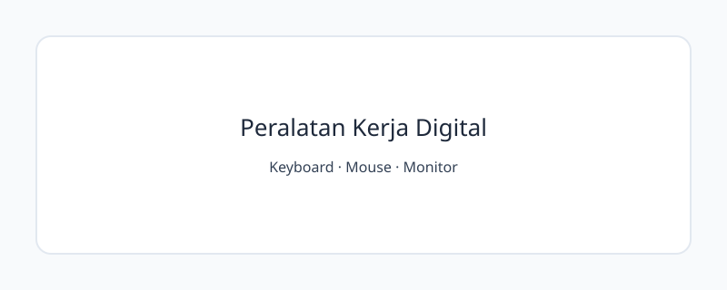

<!-- _class: lead -->
<!-- _paginate: skip -->
<!-- _footer: '' -->

# HTML5 dan Struktur Semantik

**Bab 2** · Menyusun halaman yang jelas sebelum menata tampilannya

Studi kasus: **Tokosaya**

<!--
Bab ini melanjutkan latihan membuat dokumen HTML di Bab 1. Tekankan bahwa fokus
kita sekarang bukan membuat halaman terlihat menarik, melainkan menyusun dan
memberi nama pada informasi dengan tepat. Tampilan visual akan dibahas di bab berikutnya.
-->

---

# Tujuan Pembelajaran

Setelah menyelesaikan bab ini, Anda bisa:

- Menjelaskan struktur dasar dokumen HTML5 dan metadata penting
- Memilih elemen konten berdasarkan maknanya, bukan tampilannya
- Menyusun landmark semantik pada halaman Tokosaya
- Membedakan penggunaan `div`, `section`, dan `article`
- Memahami manfaat semantik untuk aksesibilitas, SEO, dan pemeliharaan kode
- Menyusun struktur yang konsisten untuk `index.html` dan `tentang.html`

<!--
Tujuan ini mendukung CPMK 2: membuat website beberapa halaman dengan HTML5
semantik. Di praktikum, kita akan memeriksa strukturnya sebelum menambahkan CSS.
-->

---

# Saat Semua Hanya `div`

Halaman panjang yang semua bagiannya tidak punya nama jelas bisa menyulitkan:

| Pengguna atau tim | Dampaknya |
|---|---|
| Developer | Sulit menemukan batas bagian |
| Pengguna screen reader | Sulit melompat ke isi utama |
| Mesin pencari | Struktur konten kurang jelas |

> Markup bukan cuma pembungkus. Markup membantu kita memberi nama pada struktur informasi.

<!--
Gunakan kisah Tokosaya sebagai pembuka diskusi: bagian "kisah Tokosaya" sulit
dipindahkan saat semuanya berupa `div` bertumpuk. Ajak mahasiswa membahas siapa
yang paling terdampak dan alasannya.
-->

---

<!-- _class: section -->
<!-- _footer: '' -->

# Fondasi Dokumen HTML5

## Siapkan kerangkanya sebelum mengisi halaman

<!--
Peralihan dari masalah struktur menuju kerangka dasar dokumen. Ingatkan bahwa
browser tetap bisa menampilkan HTML yang kurang lengkap, tetapi hasilnya tidak
berarti markup tersebut sudah benar.
-->

---

# Pohon Dokumen HTML5

```text
<!DOCTYPE html>          deklarasi mode standar
└── html lang="id"       bahasa seluruh dokumen
    ├── head             informasi tentang dokumen
    │   ├── meta
    │   └── title
    └── body             konten halaman yang terlihat
```

- `DOCTYPE` selalu berada di awal dokumen
- `head` memberi informasi kepada browser dan alat bantu
- `body` memuat isi yang ditampilkan di halaman

<!--
Tunjukkan bahwa `head` dan `body` adalah dua elemen utama di dalam `html`.
Atribut `lang="id"` membantu *screen reader* melafalkan teks, serta membantu
kamus ejaan dan alat penerjemah.
-->

---

# Isi `head` yang Penting

```html
<meta charset="UTF-8">
<meta name="viewport" content="width=device-width, initial-scale=1.0">
<meta name="description" content="Profil dan layanan Tokosaya.">
<title>Tokosaya | Belanja Tepat, Kirim Cepat</title>
```

- `charset` memastikan karakter tampil dengan benar
- `viewport` menyesuaikan lebar halaman dengan perangkat
- `description` merangkum tujuan halaman untuk hasil pencarian
- `title` yang unik tampil di tab dan membantu pengguna mengenali halaman

<!--
Meta charset diletakkan lebih awal agar browser segera mengetahui pengodean.
Setiap halaman Tokosaya memiliki title unik; description merangkum halaman, bukan
menjadi paragraf yang tampil di body.
-->

---

# Heading Membantu Menjelajahi Halaman

```text
h1  Tentang Tokosaya
├── h2  Profil
├── h2  Visi dan Misi
│   └── h3  Misi
└── h2  Nilai Layanan
```

- Gunakan satu `h1` untuk topik utama halaman
- Jangan melompati level heading
- Pilih heading menurut hierarki informasi
- Atur ukuran visual nanti dengan CSS

<!--
*Screen reader* bisa menampilkan daftar heading untuk membantu pengguna berpindah
bagian. Jangan memilih `h4` hanya karena ukuran bawaannya terlihat pas; tampilan
heading bisa diatur dengan CSS.
-->

---

# Teks dengan Makna

```html
<p>
  Pesanan diproses <strong>paling lambat hari kerja berikutnya</strong>.
  Produk tersedia dalam versi <em>reguler</em> dan ekspres.
  <mark>Promo akhir pekan</mark> berlaku sampai Minggu.
</p>
```

- `p` membungkus satu blok pikiran
- `strong` menandai informasi yang penting
- `em` memberi penekanan saat dibaca
- `mark` menyorot teks yang relevan dalam konteks tertentu

<!--
Elemen-elemen ini menyampaikan makna, bukan cuma membuat teks tebal, miring, atau
berwarna. Jarak dan tampilan akan diatur dengan CSS.
-->

---

# Memilih Jenis Daftar

| Makna isi | Elemen | Contoh Tokosaya |
|---|---|---|
| Urutan tidak penting | `ul` | Daftar layanan |
| Langkah berurutan | `ol` | Cara memesan |
| Istilah dan penjelasan | `dl` | Nilai layanan |

```html
<dl>
  <dt>Pengiriman</dt>
  <dd>Pesanan dikirim dengan pelacakan.</dd>
</dl>
```

<!--
Ajukan tiga contoh: langkah memesan, kumpulan merek, dan pasangan nilai layanan.
Ajak mahasiswa memilih jenis daftar sebelum menunjukkan contoh kodenya.
-->

---

# Tabel untuk Data Baris dan Kolom

```html
<table>
  <caption>Produk unggulan Tokosaya</caption>
  <thead>
    <tr><th scope="col">Produk</th><th scope="col">Harga</th></tr>
  </thead>
  <tbody>
    <tr><th scope="row">Keyboard KX-210</th><td>Rp650.000</td></tr>
  </tbody>
</table>
```

- `caption` menjelaskan isi tabel
- `thead` mengelompokkan baris judul kolom
- `th scope` menjelaskan apakah judul berlaku untuk kolom atau baris
- Gunakan tabel untuk data, bukan untuk mengatur layout

<!--
Tanpa `caption` dan header, pengguna *screen reader* lebih sulit memahami konteks
tiap sel. Ingatkan juga: tabel untuk layout memberi makna yang keliru; urusan
layout adalah pekerjaan CSS.
-->

---

# Link yang Jelas

```html
<a href="tentang.html">Kenali Tokosaya</a>
<a href="https://www.example.org"
   target="_blank" rel="noopener">Baca panduan eksternal</a>
```

- Link relatif menghubungkan halaman dalam proyek
- Link absolut menyertakan alamat lengkap
- Pilih teks link yang tetap jelas saat dibaca sendiri
- Buka tab baru hanya jika memang diperlukan untuk link eksternal

<!--
Link internal seperti `tentang.html` tetap berfungsi saat folder proyek dipindahkan.
Hindari teks seperti "klik di sini": *screen reader* bisa menampilkan daftar link
tanpa kalimat di sekitarnya.
-->

---

# Membuat Gambar Lebih Mudah Dipahami

```html
<figure>
  
  <figcaption>Peralatan kerja digital untuk kebutuhan harian.</figcaption>
</figure>
```

- Tulis `alt` yang menjelaskan fungsi gambar dalam konteks
- Gunakan `alt=""` hanya untuk gambar dekoratif
- `width` dan `height` membantu browser menyiapkan ruang untuk gambar
- Pasangkan gambar dan keterangan dengan `figure`–`figcaption`

<!--
`alt` bukan nama file atau deskripsi panjang yang tidak perlu. Untuk gambar dekoratif,
gunakan `alt=""` agar tidak mengganggu pengguna *screen reader*.
-->

---

# Struktur Form Dasar

```html
<form action="/kirim" method="post">
  <label for="email">Alamat email</label>
  <input type="email" id="email" name="email">

  <label for="pesan">Pesan</label>
  <textarea id="pesan" name="pesan"></textarea>
  <button type="submit">Kirim Pesan</button>
</form>
```

- `label for` harus cocok dengan `id` kontrol
- `name` menjadi nama data yang dikirim
- `type="email"` menyatakan jenis isian
- Bab ini membahas strukturnya; desain form dibahas lebih lengkap di Bab 11

<!--
Hubungan label dan input membuat label bisa diklik dan memberi nama pada kontrol
bagi *screen reader*. Jenis input, validasi visual, dan layout dibahas di Bab 11.
-->

---

<!-- _class: section -->
<!-- _footer: '' -->

# Memberi Nama pada Bagian Halaman

## Elemen semantik membantu kita memahami susunan konten

<!--
Jelaskan bahwa elemen semantik halaman melengkapi elemen konten. Heading,
paragraf, dan tabel juga punya makna; bagian ini fokus pada susunan wilayah halaman.
-->

---

# Anatomi Elemen Semantik

```text
header  identitas halaman atau bagian
nav     kumpulan tautan navigasi
main    isi utama; satu di setiap halaman
├── section  kelompok konten bertema, biasanya punya judul
├── article  konten yang bisa berdiri sendiri
└── aside    konten tambahan yang bisa dilepas
footer  kontak, kredit, atau kebijakan
```

- `address` menandai kontak organisasi atau penulis
- `time datetime` memberi tanggal yang dipahami mesin
- Landmark membantu pengguna berpindah antarbagian

<!--
Tidak semua kumpulan link perlu dibungkus dengan `nav`. Setiap halaman cukup
memiliki satu `main`, dan `main` tidak ditempatkan di dalam `header` atau `footer`.
-->

---

# Memilih `div`, `section`, atau `article`

| Elemen | Gunakan ketika | Pertanyaan bantu |
|---|---|---|
| `section` | Konten membentuk kelompok bertema | Apakah bagian ini punya judul yang sesuai? |
| `article` | Konten bisa berdiri sendiri dan dipindahkan | Apakah masih bermakna tanpa konteks halaman? |
| `div` | Hanya perlu pembungkus netral | Apakah tidak ada elemen semantik yang cocok? |

> Pilih elemen berdasarkan maknanya, bukan tampilannya.

<!--
Kartu produk yang bisa berdiri sendiri atau berita biasanya cocok memakai `article`.
Kelompok "Visi dan Misi" cocok memakai `section`. Pembungkus grid yang hanya membantu
pengaturan tampilan bisa tetap memakai `div`.
-->

---

# Mengapa Semantik Penting

| Manfaat | Yang terbantu |
|---|---|
| Aksesibilitas | *Screen reader* bisa membantu pengguna menavigasi landmark dan heading |
| SEO dasar | Struktur dan bagian konten lebih mudah dikenali |
| Pemeliharaan | Susunan dan peran tiap bagian lebih mudah dipahami |

- Semantik adalah fondasi SEO, tapi bukan satu-satunya faktor
- Struktur yang jelas juga membantu browser dan alat pengembang

<!--
Fokuskan pembahasan pada manfaat struktur. SEO juga dipengaruhi kualitas konten,
kecepatan, dan kecocokan di berbagai perangkat. Hindari menjanjikan peringkat tertentu.
-->

---

<!-- _class: compact -->

# Studi Kasus: Portal Berita Kampus

**Sebelum:** pembungkus netral dipakai untuk semua bagian halaman.

```html
<div><div>Portal Mahasiswa</div>
  <div>Beranda · Riset · Kontak</div>
  <div>Berita utama · Berita lain</div>
</div>
```

**Sesudah:** tiap bagian halaman dan berita punya peran yang jelas.

```html
<header><nav>...</nav></header>
<main><article><h2>Berita kampus</h2></article></main>
<aside>Berita terpopuler</aside>
<footer>Kontak redaksi</footer>
```

<!--
Berita memakai `article` karena bisa berdiri sendiri. Panel "terpopuler" memakai
`aside` karena bisa dilepas tanpa mengganggu isi utama. Ajak mahasiswa menunjukkan
bagian yang bisa dituju langsung oleh pengguna *screen reader*.
-->

---

<!-- _class: compact -->

# Peta Semantik Beranda Tokosaya

```text
index.html
├── head: charset · viewport · description · title
├── header.site-header
│   ├── tautan logo
│   └── nav: Beranda · Katalog · Tentang · Kontak · Keranjang
├── main
│   ├── section.hero: h1 · subjudul · ilustrasi · tautan katalog
│   ├── section.unggulan: h2 · tabel produk
│   └── section.layanan: h2 · daftar layanan
└── footer.site-footer: address · tagline · hak cipta
```

Satu topik utama berarti satu `h1`; bagian berikutnya memakai heading secara berurutan.

<!--
Peta ini menggabungkan elemen konten dan landmark. Pastikan menu navigasi
konsisten di semua halaman.
-->

---

<!-- _class: compact -->

# Peta Semantik Tentang Tokosaya

```text
tentang.html
├── head: title dan description khusus halaman ini
├── header: logo + nav yang sama dengan beranda
├── main
│   ├── h1: Tentang Tokosaya
│   ├── section: Profil
│   ├── section: Visi dan Misi
│   ├── section: Nilai Layanan → dl
│   └── section: Kunjungi Kami → address
└── footer: kontak dan hak cipta
```

- Struktur bagian luar tetap sama di setiap halaman
- Isi `main` disesuaikan dengan topik halaman

<!--
`title` dan `description` dibuat berbeda untuk tiap halaman. Navigasi dan footer
yang konsisten membantu pengguna mengenali pola website saat berpindah halaman.
-->

---

<!-- _class: section -->
<!-- _footer: '' -->

# Praktik: Dua Halaman Tokosaya

## Pastikan strukturnya jelas sebelum menambahkan CSS

<!--
Tujuan praktik ini bukan membuat halaman terlihat cantik. Buat `index.html` dan
`tentang.html`, periksa link dan strukturnya, lalu tambahkan gaya di bab berikutnya.
-->

---

<!-- _class: compact -->

# Persiapan Proyek

```text
tokosaya-css/
├── img/
│   ├── logo-tokosaya.svg
│   └── hero-tokosaya.svg
├── index.html
└── tentang.html
```

- Lanjutkan dari folder proyek Bab 1
- Buat dua file HTML dan folder `img`
- Gunakan gambar placeholder dari buku
- CSS belum diperlukan

<!--
Halaman katalog dan kontak lengkap akan dibuat di bab berikutnya. Ingatkan mahasiswa
untuk tidak menghapus file hasil Bab 1 yang masih perlu disimpan.
-->

---

<!-- _class: compact -->

# Membuat Header dan Navigasi

```html
<header class="site-header">
  <a class="site-brand" href="index.html">
    
  </a>
  <nav class="site-nav" aria-label="Navigasi utama">
    <ul>
      <li><a href="index.html">Beranda</a></li>
      <li><a href="katalog.html">Katalog</a></li>
      <li><a href="tentang.html">Tentang</a></li>
      <li><a href="kontak.html">Kontak</a></li>
    </ul>
  </nav>
</header>
```

- Gunakan menu dan urutan yang sama di kedua halaman
- Link relatif menghubungkan halaman-halaman di proyek

<!--
Nama file yang belum dibuat boleh dipakai sebagai tujuan link. Tekankan pentingnya
menu yang konsisten; jangan membuat daftar menu berbeda di halaman Tentang.
-->

---

<!-- _class: compact -->

# Menyusun Beranda

```html
<main>
  <section class="hero-section">
    <h1>Peralatan Kerja Digital untuk Semua</h1>
    <p>Belanja tepat, kirim cepat.</p>
    <figure>
      
      <figcaption>Pilihan untuk kebutuhan harian.</figcaption>
    </figure>
    <a href="katalog.html">Lihat Katalog</a>
  </section>
  <!-- Tambahkan section produk unggulan dan layanan -->
</main>
```

- Tabel produk unggulan memuat `caption`, baris kepala, dan tiga produk
- Footer memuat `address`, email, nomor telepon, dan hak cipta

<!--
Bagian produk memakai tabel karena datanya dibaca dalam baris dan kolom. Tambahkan
`th scope="row"` pada nama produk; layanan bisa ditampilkan sebagai daftar.
-->

---

<!-- _class: compact -->

# Menyusun Halaman Tentang

```html
<main>
  <h1>Tentang Tokosaya</h1>
  <section>
    <h2>Profil</h2>
    <p>Tokosaya adalah UMKM aksesori dan elektronik komputer.</p>
  </section>
  <section>
    <h2>Visi dan Misi</h2>
    <p>...</p>
  </section>
  <section>
    <h2>Nilai Layanan</h2>
    <dl>...</dl>
  </section>
  <section><h2>Kunjungi Kami</h2><address>...</address></section>
</main>
```

Ubah juga `title` dan `description`; pertahankan header dan navigasi yang konsisten.

<!--
Minta mahasiswa mengisi isi visi, misi, nilai, dan alamat dari spesifikasi
Tokosaya. Setiap section punya heading dan berada di dalam satu main.
-->

---

# Periksa Hasil di Browser

1. Buka `index.html` dan periksa judul tab
2. Baca urutan isi dari atas ke bawah
3. Klik link Tentang, lalu kembali ke Beranda
4. Periksa struktur elemen dengan DevTools

- Pastikan satu `h1`, satu `nav`, dan satu `main`
- Pastikan setiap gambar memiliki atribut `alt`

<!--
Uji dokumen tanpa CSS: apakah urutan dan maknanya masih dapat dipahami? Di
DevTools, telusuri pohon elemen alih-alih hanya menilai tampilannya.
-->

---

# Latihan: Tentukan Elemen yang Tepat

Pilih elemen untuk setiap kebutuhan berikut:

- Lima langkah cara memesan
- Daftar merek komputer
- Pasangan nama dan penjelasan layanan
- Berita yang tetap bermakna saat dibagikan sendiri
- Pembungkus yang hanya dibutuhkan untuk styling

> Jelaskan alasan pilihan, bukan hanya nama elemennya.

<!--
Jawaban yang diharapkan: ol, ul, dl, article, dan div. Tanyakan apakah ada
konteks tambahan yang dapat mengubah keputusan pada kasus tertentu.
-->

---

# Cek Markup Semantik

- Dokumen diawali `DOCTYPE` dan `html lang="id"`
- `head` berisi charset, viewport, description, dan `title` unik
- Heading berurutan dengan satu `h1`
- Tabel dipakai untuk data; gambar punya `alt`
- Landmark memberi nama pada bagian halaman; teks link menjelaskan tujuannya
- Label form terhubung ke kolom yang sesuai

<!--
Gunakan daftar ini untuk memeriksa halaman sebelum menambahkan CSS. Minta pasangan
untuk saling memeriksa kedua halaman dan menunjukkan buktinya di markup.
-->

---

# Rangkuman

- HTML5 memberi struktur dan makna pada dokumen web
- Elemen konten dipilih sesuai tujuan informasinya
- Landmark dan heading membantu orang menavigasi halaman
- `div` tetap berguna untuk pembungkus tanpa makna
- Struktur semantik memudahkan aksesibilitas dan pemeliharaan
- Dua halaman Tokosaya berbagi pola navigasi yang konsisten

<!--
Tutup dengan gagasan utama: tampilan dapat berubah, struktur yang jelas tetap
membantu manusia dan alat memahami isi halaman.
-->

---

<!-- _class: lead -->
<!-- _footer: '' -->

# Tugas dan Refleksi

Tambahkan bagian **Jam Layanan** ke `tentang.html`.

Gunakan `section` dengan tabel atau `dl` yang sesuai.  
Lalu jelaskan pilihan elemen Anda dalam satu paragraf.

**Pertanyaan refleksi:** apa yang masih jelas ketika CSS dihilangkan?

<!--
Tugas individu: jam layanan Senin–Sabtu, 09.00–17.00 WIB. Nilai satu h1,
heading berurutan, tabel atau dl yang benar, serta tidak ada kelas styling
yang belum dipelajari.
-->
