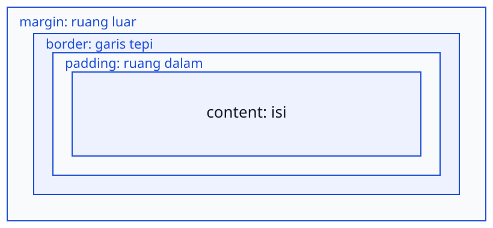

<!-- _class: lead -->
<!-- _paginate: skip -->
<!-- _footer: '' -->

# CSS Box Model dan Layout

**Bab 5** · Menghitung kotak, bukan menebak jarak

Studi kasus: **Tokosaya**

<!--
Buka dengan pertanyaan: kenapa halaman yang HTML-nya udah rapi masih bisa meleset
beberapa piksel? Sebutkan bahwa bab ini mengubah cara kerja dari menebak jarak jadi
menghitung kotak. Ingatkan bahwa hasil akhirnya adalah komponen kartu produk
Tokosaya yang bisa kamu inspeksi sendiri di DevTools.
-->

---

# Tujuan Pembelajaran

Setelah menyelesaikan bab ini, kamu bisa:

- Anatomi box model: content, padding, border, margin
- Hitungan lebar total kotak di content-box dan border-box
- Pemasangan `box-sizing: border-box` global dan alasannya
- Perilaku display: block, inline, dan inline-block
- Penanganan overflow dan pemenggalan teks panjang
- Position, z-index, dan sistem jarak skala 8px

<!--
Bacakan tujuan ini cepat saja, lalu tekankan kesinambungannya: Bab 4 menyiapkan
token warna dan huruf, bab ini menambahkan jarak dan penghitungan. Sebutkan bahwa
praktikumnya menghasilkan komponen kartu produk, bukan halaman baru. Tanyakan siapa
yang selama ini menebak nilai padding.
-->

---

# Tiga Gejala, Satu Akar

Kamu magang di tim digital Tokosaya, dan halaman katalognya berulah.

| Yang terlihat | Dugaan awal | Yang sebenarnya |
|---|---|---|
| Badge terlempar ke pojok kanan | salah tulis HTML | induknya belum `relative` |
| Kartu ketiga meluber | kontainer kekecilan | mode `content-box` menambah padding |
| Jarak kartu 20, 18, lalu 28 px | desainnya beda | belum ada skala jarak tetap |

> Ketiga gejala itu bukan kesalahan HTML, melainkan satu akar yang sama: kotak.

<!--
Ceritakan tiga gejalanya kayak pengalaman magang di buku, jangan cuma dibacakan
tabelnya. Tanyakan dugaan awal mahasiswa buat gejala pertama; jawaban yang
diharapkan: itu bukan salah markup, tapi induknya belum diposisikan. Tekankan bahwa
ketiga gejala punya satu akar, yaitu kotak, dan itu yang dibongkar sepanjang bab.
-->

---

<!-- _class: section -->
<!-- _footer: '' -->

# Kotak dan Cara Menghitungnya

## Empat lapisan yang menentukan ruang elemen

<!--
Transisi dari gejala menuju alat ukurnya. Katakan bahwa bagian pertama ini paling
banyak mengubah cara berpikir: setelah paham lapisannya, layout jadi soal aritmetika.
Tahan dulu soal display dan position, itu masuk di bagian kedua.
-->

---

# Anatomi Kotak: Empat Lapisan



- Urutan dari dalam ke luar: content, padding, border, margin
- Diagram kotak yang sama bisa kamu inspeksi di DevTools

<!--
Tunjuk langsung ke layar: dari tengah ke luar, content, padding, border, margin.
Tekankan bahwa padding ikut memakai warna latar elemen, sedangkan margin tetap
transparan. Minta mahasiswa menebak lapisan mana yang membuat kartu terasa lega pas
dibaca.
-->

---

# Analogi Poster Berbingkai

| Lapisan | Padanan di dinding kantor |
|---|---|
| content | kanvas poster tempat gambar dicetak |
| padding | passe-partout di sekeliling kanvas |
| border | bingkai kayu yang membatasi kanvas |
| margin | jarak ke poster lain di dinding |

> Padding itu merapikan isi ke bingkainya; margin menjaga jarak antarbingkai.

<!--
Analogi ini paling berguna buat menjelaskan keputusan desain ke rekan non-teknis.
Tanyakan lapisan mana yang warnanya ikut berubah kalau latar elemen diberi warna.
Jawaban yang diharapkan: content dan padding, sedangkan border dan margin punya
hidup sendiri.
-->

---

# Padding dan Margin Bukan Hal yang Sama

- Padding adalah bagian dari tubuh elemen itu sendiri
- Klik dan latar ikut memenuhi seluruh area padding
- Padding jadi alat utama memberi ruang napas dalam kartu
- Margin berada di luar kotak dan selalu transparan
- Margin cuma menahan jarak ke kotak tetangga
- Border biasanya tipis, 1 sampai 2 px

<!--
Tekankan konsekuensi praktisnya: kartu berlatar putih dengan margin 32 px tetap
menampakkan bidang kaca di sekelilingnya. Tanyakan properti mana yang harus dipakai
kalau bidang itu mau ikut berwarna; jawabannya padding. Ingatkan juga bahwa area
klik tombol bertambah lewat padding, bukan margin.
-->

---

# Margin Vertikal Bisa Runtuh

- Margin bawah dan margin atas bertetangga tidak dijumlahkan
- Yang dipakai adalah nilai yang paling besar
- `16px` bawah bertemu `24px` atas, jaraknya jadi 24 px
- Padding tidak punya perilaku runtuh ini
- Jarak satu arah lebih aman: pakai `margin-bottom` saja

> Ritme vertikal antarseksi lebih aman distandarkan lewat padding kontainer.

<!--
Perilaku ini yang paling sering bikin mahasiswa menuduh CSS-nya rusak. Hitung
bareng-bareng: 16 px bertemu 24 px jadi 24 px, bukan 40 px. Lanjutkan dengan
pertanyaan kenapa padding dipilih buat ritme antarseksi, dan jawaban yang
diharapkan: padding tidak runtuh sehingga jaraknya bisa diprediksi.
-->

---

# Angka width Cuma Sepotong Kotak

Bawaannya CSS memakai mode `box-sizing: content-box`.

```css
.panel {
  width: 280px;                 /* hanya mengukur area konten */
  padding: 16px;                /* ditambahkan di luar angka itu */
  border: 4px solid #4F46E5;
}
```

- Lebar di layar: `280 + 16 + 16 + 4 + 4 = 304 px`
- Angka `width` cuma milik area konten
- Selisih 24 px inilah yang memunculkan bilah gulir

<!--
Minta mahasiswa menghitung sendiri sebelum kamu tunjukkan 304 px di layar. Buka
panel Computed di DevTools dan tunjukkan angka yang sama persis. Tanyakan kenapa
kartu yang "seharusnya" muat tiga di satu baris jadi meluber sepuluh piksel.
-->

---

<!-- _class: compact -->

# Satu Aturan border-box Global

```css
/* Semua kotak dihitung dari tepi border ke tepi border */
*,
*::before,
*::after {
  box-sizing: border-box;
}
```

`File: tokosaya-css/css/style.css`

- Selector `*` menjangkau seluruh elemen
- `*::before` dan `*::after` ikut disamakan
- Angka `width` jadi lebar kotak utuh
- Konten menyusut kalau padding membesar
- Pasang sekali di awal, jangan dicampur dua mode

<!--
Tekankan bahwa satu aturan ini mengubah arti semua angka lebar di seluruh file.
Sebutkan bahwa mencampur `content-box` dan `border-box` di satu proyek adalah sumber
bug layout yang paling sunyi. Tanyakan apa yang terjadi pada konten kalau padding
diperbesar di mode ini; jawabannya: konten yang menyusut, bukan kotaknya.
-->

---

# Menahan Kotak dengan min dan max

- `width` tanpa nilai lain mengikuti lebar induk
- `auto` membiarkan browser menghitung sendiri
- `max-width: 100%` mencegah gambar meluber dari kartu
- `min-height` menahan area biar tidak terlalu pendek
- `width: 280px` plus `max-width: 100%` pola klasik kartu
- `.container` dibatasi 960 px supaya baris teks nyaman dibaca

<!--
Tunjukkan perilaku pola klasiknya: di layar lebar kartu tetap 280 px, di layar
sempit kartu memilih menyusut daripada memaksa bilah gulir. Tanyakan kenapa kita
nggak mengunci `height` pada paragraf yang isinya bisa bertambah. Jawaban yang
diharapkan: teks yang terpotong adalah kegagalan aksesibilitas, jadi pakai
`min-height`.
-->

---

# Studi Kasus: Dashboard SIAKAD

Fakultas merancang ulang dashboard mahasiswa: tiga kartu informasi utama.

- Padding 40 px bikin kartu terlalu tinggi
- Jarak di dalam kartu campur: 12, 17, dan 28 px
- Kartu ketiga terlempar keluar layar laptop
- Kolom kartu tidak sejajar di tepi atas
- Perbaikan: padding 24 px dan 16 px dari skala 8
- Jarak antarkartu 32 px lewat margin satu arah

> Box model bukan urusan estetika, tapi kecepatan pengguna memahami data.

<!--
Ceritakan dampaknya dari perilaku layar, bukan dari angka statistik. Tanyakan
kenapa jarak 17 px antara label dan nilainya justru memecah kelompok informasi.
Jawaban yang diharapkan: mata membacanya kayak dua blok berbeda. Sebutkan bahwa
pola yang sama bakal dibangun ulang dengan Grid di Bab 7.
-->

---

<!-- _class: section -->
<!-- _footer: '' -->

# Jenis Kotak dan Konten Meluber

## Display, overflow, dan teks yang tidak muat

<!--
Masuk ke bagian yang paling banyak memunculkan pertanyaan di kelas. Katakan bahwa
banyak "kesalahan styling" sebenarnya cuma perilaku bawaan elemen yang belum
dipahami. Ingatkan bahwa semua contoh di bagian ini langsung dipakai di praktikum.
-->

---

# display Menentukan Jenis Kotak

- Properti `display` memilih jenis kotak elemen
- Nilai bawaannya ditetapkan stylesheet browser
- `p`, `div`, `h1`, dan `ul` berperilaku `block`
- `span`, `a`, `strong`, dan `em` berperilaku `inline`
- `img` dan `input` inline khusus, tetap menerima dimensi
- Jenis kotak bisa diubah tanpa menyentuh HTML

<!--
Tanyakan elemen apa yang bakal kamu beri padding penuh: link di dalam paragraf atau
badge di dalam daftar. Jawaban yang diharapkan: keduanya perlu perlakuan berbeda,
dan itu inti subbab ini. Sebutkan bahwa mengubah jenis kotak lewat CSS jauh lebih
murah daripada menambah pembungkus di HTML.
-->

---

# block, inline, dan inline-block

| Perilaku | block | inline | inline-block |
|---|---|---|---|
| Mulai baris baru | ya | tidak | tidak |
| `width` dan `height` | berlaku | diabaikan | berlaku |
| `margin` atas dan bawah | berlaku | diabaikan | berlaku |
| `padding` atas dan bawah | mendorong teks | cuma melukis latar | mendorong baris |
| Contoh | `p`, `div`, `ul` | `span`, `a` | badge, tombol |

<!--
Bahas kolom `inline` paling lama, karena di situ letak kebingungannya: padding atas
bawahnya terlihat tapi tidak menggeser apa pun. Minta mahasiswa menebak kenapa
`width: 120px` pada `span` tidak berpengaruh sama sekali. Jawaban yang diharapkan:
dimensi elemen inline memang diabaikan browser.
-->

---

# Badge Tokosaya Butuh inline-block

- Badge "Best Seller" adalah label kecil dekat harga
- Sebagai `inline`, padding dan dimensinya diabaikan
- Sebagai `block`, badge memaksa baris baru
- Sebagai `inline-block`, kotak penuh tapi tetap mengalir
- Pola yang sama dipakai buat item navigasi
- `ul > li` jadi deretan horizontal karena diubah `inline-block`

<!--
Jadikan badge sebagai contoh tunggal yang diulang terus: satu properti, tiga
perilaku berbeda. Tanyakan apa yang terjadi kalau badge dibiarkan `inline` padahal
padding-nya 8 px 16 px. Jawaban yang diharapkan: bentuknya remuk dan latarnya
menempel di teks tanpa mendorong baris.
-->

---

<!-- _class: compact -->

# Trik Celah Antar Kotak

```css
.daftar-produk {
  font-size: 0;                /* hapus celah spasi antar item */
}

.produk-card {
  display: inline-block;
  font-size: 16px;             /* kembalikan ukuran teks kartu */
}
```

`File: tokosaya-css/css/style.css`

- Celah itu sebenarnya spasi yang kamu tulis di HTML
- `inline-block` memperlakukan kotak kayak kata
- Wadah disetel nol, anggotanya dikembalikan sendiri

<!--
Tunjukkan celahnya dulu di browser sebelum kamu jelaskan triknya, karena gejalanya
kelihatan kayak bug. Tekankan pasangan aturannya: wadah `font-size: 0`, anggota
`font-size` eksplisit. Sebutkan bahwa Bab 6 akan mengganti seluruh trik ini dengan
`gap` pada Flexbox, jadi ini bekal memahami kenapa Flexbox ada.
-->

---

# overflow: Nasib Konten Meluber

| Nilai | Perilaku |
|---|---|
| `visible` | bawaan; konten menumpang keluar kotak |
| `hidden` | memotong tanpa bilah gulir |
| `scroll` | selalu menampilkan bilah gulir |
| `auto` | bilah gulir cuma kalau diperlukan |

- `auto` adalah pilihan aman buat panel yang isinya dinamis
- `overflow` tidak mengubah hitungan lebar kotak

<!--
Tanyakan bedanya `scroll` dan `auto`; jawaban yang diharapkan: `scroll` menampilkan
bilah walaupun kontennya muat, jadi terlihat berlebihan. Tekankan urutan kerjanya:
`border-box` dulu, baru `overflow` sebagai pengaman visual. Sebutkan bahwa `clip`
lebih baru dan dukungan browsernya perlu diperiksa di dokumentasi resmi.
-->

---

# Potong Melingkar dan Gulir Panel

- Kartu ber-radius 12 px masih menampakkan sudut gambar yang tajam
- `overflow: hidden` di media memotong gambar ikut sudut kartu
- Tabel presensi panjang dibungkus wadah bertinggi terbatas
- `overflow-y: auto` bikin panel menggulir sendiri
- Halaman tidak ikut tergulir, konteks pengguna tetap terjaga

<!--
Tunjukkan sudut kartu yang masih tajam sebelum `overflow: hidden` dipasang; itu
perbedaan yang paling mudah dilihat kelas. Tekankan prinsip besarnya: yang dibatasi
adalah kotaknya, bukan isinya. Tanyakan apa akibatnya kalau seluruh halaman yang
menggulir buat tabel yang panjang.
-->

---

<!-- _class: compact -->

# Elipsis: Tiga Properti Satu Kesatuan

```css
.nama-terpotong {
  white-space: nowrap;         /* larang teks turun ke baris baru */
  overflow: hidden;            /* potong bagian yang keluar */
  text-overflow: ellipsis;     /* tampilkan tanda potong */
}
```

`File: tokosaya-css/css/style.css`

- Tanpa `overflow: hidden`, tanda potongnya tidak muncul
- Tanpa `white-space: nowrap`, tidak ada yang terpotong
- Tambahkan atribut `title` supaya nama penuh tetap terbaca

<!--
Minta mahasiswa menghapus satu properti satu per satu dan mengamati akibatnya;
ketiganya memang satu kesatuan. Tekankan bagian `title`: memotong teks yang tidak
bisa diamati kembali adalah kegagalan informasi, bukan keindahan tipografi.
Tanyakan di mana pola ini bakal dipakai di kartu produk.
-->

---

# Teks Panjang: Dua Resep Lain

- `overflow-wrap: break-word` mematahkan kata yang super panjang
- Cocok buat URL atau nama file yang tidak boleh melebar
- `-webkit-line-clamp` membatasi deskripsi jadi dua baris
- Teknik clamp masih memakai prefiks vendor
- Kalau ragu, biarkan deskripsi menurun penuh
- Putusan desainnya tetap sama: kotak yang dibatasi, bukan konten

<!--
Tunjukkan nama file panjang kayak laporan tahunan yang bikin panel melebar tanpa
`break-word`. Sebutkan bahwa `line-clamp` tergolong prefiks vendor dan dukungannya
perlu diperiksa di dokumentasi resmi. Tanyakan mana yang lebih aman buat teks yang
penting: memangkas di sisi penyunting konten atau memotong otomatis.
-->

---

<!-- _class: section -->
<!-- _footer: '' -->

# Posisi Kotak dan Irama Jarak

## Mengatur tumpukan kotak, lalu menetapkan skalanya

<!--
Pindah dari "kotak jenis apa ini" ke "di mana kotak ini duduk dan berapa jaraknya".
Katakan bahwa bagian inilah yang menyelesaikan kasus Apersepsi: badge yang terlempar
dan jarak yang tidak konsisten.
-->

---

# Lima Nilai position

| Nilai | Perilaku singkat |
|---|---|
| `static` | bawaan; ikut alur dokumen, diatur lewat margin |
| `relative` | bergeser dari posisinya, tempatnya tetap |
| `absolute` | lepas dari alur, menempel leluhur terdekat |
| `fixed` | menempel viewport, diam walau halaman digulir |
| `sticky` | ikut alur sampai titik geser, lalu lengket |

- `relative` lebih sering dipakai sebagai landasan daripada penggeser

<!--
Tekankan kalimat paling penting di tabel ini: `relative` adalah landasan buat
anaknya yang `absolute`. Tanyakan apa landasan sebuah kotak `absolute` kalau tidak
ada satu pun leluhur yang diposisikan. Jawaban yang diharapkan: halaman itu sendiri,
dan itulah badge yang terlempar ke pojok layar.
-->

---

<!-- _class: compact -->

# Badge Menempel di Pojok Gambar

```css
.produk-media {
  position: relative;        /* badge diukur dari tepi gambar */
}

.produk-badge {
  position: absolute;
  top: 8px;
  right: 8px;
  z-index: 2;
}
```

`File: tokosaya-css/css/style.css`

- `absolute` mencari leluhur yang diposisikan
- Tanpa `relative` di induk, badge lari ke pojok halaman

<!--
Demonstrasikan ini langsung: hapus `position: relative` sebentar, muat ulang, dan
biarkan kelas melihat badge terlempar. Kembalikan lalu tekankan bahwa 8 px itu jarak
dari tepi gambar, bukan dari halaman. Ingatkan bahwa kotak `absolute` tidak menggeser
teks di bawahnya karena sudah keluar dari alur.
-->

---

# z-index pada Elemen Diposisikan

- `z-index` mengatur urutan tumpukan kotak yang bertumpuk
- Bilangan yang lebih besar tampil di depan
- Hanya bekerja kalau `position` bukan `static`
- Pakai skala kecil yang direncanakan: 1, 2, dan 10
- Hindari loncatan ke 9999 yang bikin susah di-debug
- `absolute` di dalam kotak ber-`z-index` membuat tumpukan baru

<!--
Tanyakan kenapa `z-index: 9999` dianggap kebiasaan buruk walaupun hasilnya kelihatan
benar. Jawaban yang diharapkan: nilainya tidak terdokumentasi, jadi aturan berikutnya
terpaksa menulis angka lebih besar lagi. Sebutkan bahwa susunan cukup diurus di
elemen yang diposisikan.
-->

---

# Skala Jarak Delapan Piksel

- Sistem jarak dibangun dari basis `--space-unit: 8px`
- Langkahnya 8, 16, 24, 32, 48, dan 64 px
- Setiap jarak harus jatuh di salah satu langkah itu
- Delapan membagi rata lebar layar 320, 640, 960, dan 1280
- Langkahnya halus tapi cukup langka buat menjaga irama
- Langkah 4 px cuma buat koreksi mikro, ditulis di komentar

<!--
Tanyakan kenapa 8 dipilih, bukan 5 atau 7. Jawaban yang diharapkan: karena angkanya
membagi rata lebar layar umum tanpa sisa. Tekankan efeknya ke pengguna: bagian yang
tidak berkaitan muncul pada takaran seragam, jadi mata tidak perlu mengganti ukuran
kaca pembesarnya tiap blok.
-->

---

# Kapan padding, Kapan margin

- Padding adalah bagian dari komponen itu sendiri
- Padding memperluas latar sekaligus area klik tombol
- Margin memisahkan komponen dari tetangganya
- Margin tetap transparan dan tidak ikut latar
- Jarak vertikal antarseksi lebih aman lewat padding kontainer
- Tombol berpadding 8 px sudah melampaui ambang WCAG 24 px

<!--
Ulangi padanan fisiknya: padding adalah jarak foto ke tepi paspotor, margin adalah
jarak antar paspotor di dinding. Tanyakan siapa yang selama ini memakai margin buat
melebarkan tombol; itu kebiasaan yang paling sering muncul di tugas. Sebutkan bahwa
kriteria Target Size WCAG 2.2 menetapkan area sentuh minimal 24 × 24 px.
-->

---

<!-- _class: compact -->

# Jarak Baku Proyek Tokosaya

```css
.hero {
  padding: 64px 0;             /* 8 × 8 — jeda besar antarseksi */
}

.hero-subtitle {
  margin: 0 0 32px;            /* 8 × 4 — jarak ke tombol CTA */
}

.produk-body {
  padding: 16px;               /* 8 × 2 — ruang napas dalam kartu */
}

.produk-card {
  margin: 0 16px 32px 0;       /* 8 × 2 dan 8 × 4 */
}
```

`File: tokosaya-css/css/style.css`

- Komentar `8 × n` yang menegakkan disiplin skala
- Kalau butuh lebih lega, lompat ke langkah berikutnya
- Jangan geser 3 px; pilih langkah skala yang terdekat

<!--
Buka file aslinya dan hitung satu per satu langkah skalanya bareng kelas. Tekankan
kebiasaan yang dituntut: setiap angka baru harus punya pasangan di skala. Tanyakan
apa yang harus dilakukan kalau kartu terasa perlu lebih beruang; jawaban yang
diharapkan: naik dari 16 ke 24 atau 32, bukan ke 21.
-->

---

<!-- _class: section -->
<!-- _footer: '' -->

# Praktik: Kartu Produk Tokosaya

## Delapan kartu dengan jarak yang bisa dihitung

<!--
Masuk ke praktikum. Ingatkan bahwa hasil akhirnya bukan halaman cantik, melainkan
satu komponen kartu yang setiap jaraknya bisa kamu pertanggungjawabkan. Sebutkan
bahwa kartu inilah yang nanti disusun ulang dengan Flexbox di Bab 6.
-->

---

# Langkah Praktikum

1. Buka folder proyek `tokosaya-css/` dan siapkan delapan gambar produk
2. Tulis ulang `index.html` dengan hero dan delapan kartu
3. Tulis ulang `css/style.css` dengan token, reset, dan komponen
4. Pastikan aturan `box-sizing` ada di paling atas setelah token
5. Buka di browser, pastikan tidak ada bilah gulir horizontal
6. Periksa diagram kotak `.produk-card`, lalu matikan `box-sizing` sebentar

<!--
Jalankan langkah ini sambil didemokan di layar, jangan cuma dibacakan. Langkah tujuh
dan delapan yang paling berharga: kelas melihat sendiri pembeda `content-box` dan
`border-box` di proyek nyata. Ingatkan menyimpan file sebelum memuat ulang, dan
periksa jalur `<link>` dulu kalau gaya tidak muncul sama sekali.
-->

---

<!-- _class: compact -->

# Anatomi Kartu di index.html

```html
<li class="produk-card">
  <div class="produk-media">
    
    <span class="produk-badge produk-badge-accent">Best Seller</span>
  </div>
  <div class="produk-body">
    <p class="produk-kategori">Aksesori Input</p>
    <h3 class="produk-nama">Keyboard Mekanis KX-210</h3>
    <p class="produk-harga">Rp650.000</p>
  </div>
</li>
```

`File: tokosaya-css/index.html`

- Satu kartu satu `li`, bukan kumpulan `div`
- `produk-media` menampung gambar sekaligus badge
- `width` dan `height` disamakan rasio gambar
- Tidak ada satu pun gaya inline di HTML

<!--
Tekankan pembagian tugasnya: HTML membawa peran, CSS membawa keputusan visual.
Tanyakan kenapa angka `width` dan `height` disamakan rasio gambarnya. Jawaban yang
diharapkan: supaya layout tidak melompat pas gambar selesai termuat. Pastikan semua
nama class konsisten kebab-case sebelum kelas lanjut ke file gaya.
-->

---

<!-- _class: compact -->

# Aturan Kartu di style.css

```css
.produk-card {
  display: inline-block;
  vertical-align: top;
  width: 280px;
  max-width: 100%;
  margin: 0 16px 32px 0;
  background-color: var(--clr-surface);
  border: 1px solid var(--clr-border);
  border-radius: var(--radius);
}

.produk-body {
  padding: 16px;
}
```

`File: tokosaya-css/css/style.css`

- `vertical-align: top` bikin deret kartu sejajar atas
- `width` 280 px ditahan `max-width: 100%`
- Margin 16 dan 32 px ikut langkah skala 8
- Padding badan kartu 16 px memberi ruang napas

<!--
Tunjukkan gejala sebelum `vertical-align: top`: kartu dengan isi lebih panjang bikin
deretnya bergerigi. Tanyakan kenapa `max-width: 100%` penting walaupun kartunya sudah
punya lebar tetap. Jawaban yang diharapkan: biar kartu menyusut di layar sempit
daripada memaksa bilah gulir. Sebutkan bahwa `overflow: hidden` di media akan
ditambahkan kalau latar media diberi warna.
-->

---

# Hasil yang Diharapkan

- Header putih dengan empat link navigasi berderet
- Hero dengan judul besar dan tombol indigo
- Delapan kartu berbaris tiga per baris
- Badge berwarna di pojok kanan atas setiap gambar
- Sudut gambar membulat ikut radius kartu
- Kartu menyusut tanpa bilah gulir di lebar 480 px

<!--
Bandingkan tampilan sebelum dan sesudah langsung di browser, jangan cuma
menampilkan slide ini. Kalau ada yang belum berubah, curigai jalur `<link>` dulu
sebelum menuduh kodenya salah. Ingatkan hard refresh dengan Ctrl+F5 kalau browser
masih memakai file gaya dari cache.
-->

---

# Troubleshooting Paling Sering

| Gejala | Penyebab |
|---|---|
| Kartu sejajar tepi bawah berbeda | `vertical-align` bawaan masih baseline |
| Ada celah tipis antarkartu | spasi di HTML antar `inline-block` |
| Jarak terasa lebih pendek | margin vertikal runtuh |
| Badge lari ke pojok halaman | induk belum `position: relative` |
| Kartu meluber dan muncul bilah gulir | mode `content-box` masih aktif |

<!--
Jadikan tabel ini daftar periksa pas kelas praktikum, bukan bahan bacaan. Tanyakan
gejala mana yang paling sering mereka temui di tugas sebelumnya. Tekankan bahwa
semua gejala ini bisa dipastikan lewat diagram kotak di DevTools sebelum satu baris
CSS diubah.
-->

---

# Latihan

- Hitung lebar kotak A `width: 260px; padding: 16px; border: 4px;` di mode content-box
- Dua kartu bermargin bawah 28 px dan atas 20 px: berapa jarak nyatanya?
- Ubah `.nav-item` jadi `display: block`, amati, lalu jelaskan kenapa berantakan
- Pasang pola elipsis pada nama produk WC-720, uji dengan nama 60 huruf
- Audit seluruh `padding` dan `margin` di `style.css` terhadap skala 8 px

> Tuliskan perhitungan dan alasannya, bukan cuma nama propertinya.

<!--
Kerjakan butir pertama bareng-bareng di papan, sisanya buat latihan mandiri.
Perhatikan butir kedua: tujuan soalnya bukan mencari angka, tapi menyadari bahwa
margin vertikal runtuh ke nilai terbesar. Untuk butir audit, minta mahasiswa
menandai nilai yang bukan kelipatan 8 kalau memang ada.
-->

---

# Cek Daftar Komponen Kartu

- `box-sizing: border-box` dipasang global di awal file
- Semua jarak di `style.css` kelipatan 8 px
- `.produk-media` diposisikan `relative` buat landasan badge
- Kartu memakai `inline-block` dan `vertical-align: top`
- Deret kartu bersih dari celah spasi `inline-block`
- Tidak ada bilah gulir horizontal pada lebar 1280 px

<!--
Minta mahasiswa saling memeriksa file pakai daftar ini dan menunjukkan buktinya
langsung di kode. Tanyakan nilai mana yang ternyata bisa dihapus karena sudah
diwarisi atau sudah diatur induknya. Ingatkan bahwa satu properti sebaiknya punya
satu tempat utama yang jelas.
-->

---

# Rangkuman

- Box model berlapis dari content sampai margin
- Margin vertikal bertetangga runtuh ke nilai terbesar
- `border-box` global membuat `width` jadi lebar kotak utuh
- `display` memilih jenis kotak; `overflow` mengatur konten meluber
- `relative` landasan `absolute`; `z-index` pakai skala kecil
- Skala jarak 8 px dengan padding dan margin pada tempatnya

<!--
Tutup dengan pesan utama: layout yang bisa dihitung jauh lebih mudah dirawat
daripada layout yang di tebak. Sebutkan bahwa Bab 6 mengganti trik `inline-block`
dan `font-size: 0` dengan Flexbox, `gap`, dan `justify-content`. Ingatkan bahwa
penghitungan kotak di bab ini tetap berlaku di semua model layout berikutnya.
-->

---

<!-- _class: lead -->
<!-- _footer: '' -->

# Tugas dan Refleksi

Susun `tokosaya-css/statistik.html` berisi panel "Ringkasan Tokosaya": empat kotak statistik berderet `inline-block`, seluruh jarak dari skala 8 px, dan satu badge `position: absolute`.

**Pertanyaan refleksi:** kapan kamu memilih `overflow: hidden` daripada `auto`?

<!--
Tugas individu: kumpulkan file HTML, CSS, tangkapan diagram kotak satu kartu, dan
catatan singkat pilihan margin atau padding pada tiap jarak. Nilai ketepatan skala 8
px, badge yang benar-benar menempel di kartu, dan tidak adanya bilah gulir horizontal
pada lebar 1280 px. Tekankan bahwa yang dinilai bukan jarak yang cantik, tapi jarak
yang bisa dipertanggungjawabkan.
-->
