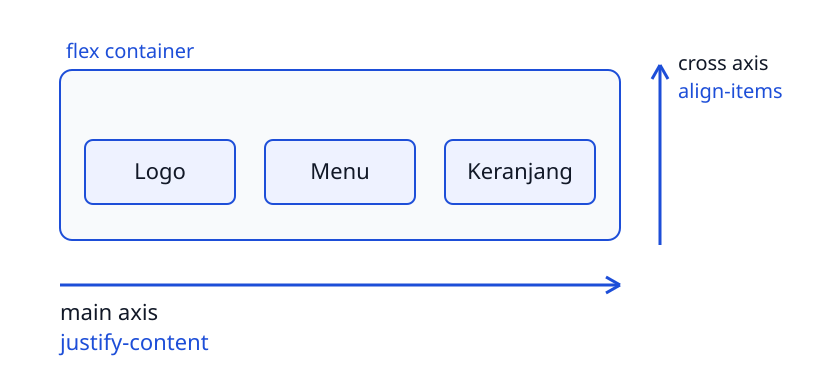

<!-- _class: lead -->
<!-- _paginate: skip -->
<!-- _footer: '' -->

# Flexbox untuk Web Layout

**Bab 6** · Membagi ruang dan menyejajarkan kotak dalam satu arah

Studi kasus: **Tokosaya**

<!--
Buka dengan mengingatkan bahwa Bab 5 selesai di level satu kotak: lebar, padding,
border, margin. Sekarang pertanyaannya naik satu tingkat, yaitu gimana beberapa
kotak berbagi ruang dalam satu baris. Sebutkan bahwa hasil akhirnya adalah
`site-nav`, hero, footer, dan baris delapan kartu produk Tokosaya.
-->

---

# Tujuan Pembelajaran

Setelah menyelesaikan bab ini, kamu bisa:

- Menjelaskan sifat satu dimensi flexbox dan dua sumbunya
- Mengidentifikasi properti flex container dan memilih yang tepat
- Mengimplementasikan properti flex item buat mengatur tiap anak
- Membangun navigasi responsif dan footer multi kolom
- Merancang baris kartu produk dengan `flex-wrap`
- Menganalisis cacat layout pada potongan kode flex

<!--
Bacakan tujuan ini sekilas, lalu tekankan bahwa semuanya bermuara ke satu
kemampuan: menata satu baris elemen supaya rapi di ukuran layar apa pun. Sebutkan
bahwa bab ini mendukung CPMK 4 dan jadi bahan latihan buat UTS. Ingatkan juga
bahwa butir terakhir menuntut alasan, bukan cuma hasil yang jalan.
-->

---

# Wireframe Baru dari Desainer

- Logo Tokosaya tetap di kiri
- Empat link pindah ke kanan
- Tombol Keranjang paling ujung
- Delapan kartu produk rapi di layar sempit
- Kartu boleh turun baris, jangan gepeng

<!--
Ceritakan revisi wireframe ini sebagai masalah nyata, bukan soal gaya. Tanyakan
apa yang bakal terjadi kalau delapan kartu dipaksa muat satu baris. Jawaban yang
diharapkan: kartunya gepeng dan teksnya rusak. Lanjutkan dengan menyebut bahwa
layar ujinya mulai dari HP sempit sampai monitor 24 inci.
-->

---

# Kenapa Box Model Belum Cukup

| Pertanyaan | Yang menjawab |
|---|---|
| Ukuran dan jarak satu kotak | Box model Bab 5 |
| Sisa ruang dibagi ke tiga kotak | Flexbox |

- Box model mengatur kotak satu per satu
- Flexbox membagi ruang antarkotak
- Dulu disiasati `float` dan margin negatif

> Satu properti di wadah, anak-anaknya ikut tertata.

<!--
Tekankan bahwa box model nggak salah, cuma belum menjangkau pertanyaan pembagian
ruang. Tanyakan siapa yang pernah pakai `float` buat menu sejajar dan repot pas
footer jatuh ke bawah. Jawaban yang diharapkan: `float` dibuat buat teks mengalir
di sekitar gambar, bukan buat layout. Jadi flexbox itu modul khusus antarmuka.
-->

---

<!-- _class: section -->
<!-- _footer: '' -->

# Konsep Flexbox dan Dua Sumbunya

## Wadah yang membagi ruang, bukan anak yang diatur satu per satu

<!--
Transisi ke bagian paling konseptual di bab ini. Katakan bahwa kalau bagian ini
lewat begitu saja, sisa bab ini bakal terasa kayak hafalan. Sepakati dulu kosakata
wadah dan butir sebelum menyentuh properti apa pun.
-->

---

# Apa Itu Flexbox

- Flexbox adalah CSS Flexible Box Layout
- Dipakai buat menyusun elemen dalam satu dimensi
- Satu baris `row` atau satu kolom `column`
- Wadah membagi ruang, bukan anak satu per satu
- Pengganti pola `float` yang gampang rusak

> Wadahnya yang membagi ruang, bukan kita yang menghitungnya.

<!--
Kata "satu dimensi" adalah kata kunci di paragraf ini; tulis di papan dan
lingkari. Tanyakan apa maksudnya satu arah, bukan kisi dua arah. Jawaban yang
diharapkan: item mengalir di satu jalur saja, ke kanan atau ke bawah, sedangkan
baris dan kolom sekaligus adalah urusan Grid di Bab 7.
-->

---

# Wadah dan Butir Lentur

```css
.site-nav {
  display: flex;
}
```

`File: tokosaya-css/css/style.css`

- `display: flex` ditulis pada elemen induk
- Induk itu berubah jadi flex container
- Semua anak langsungnya jadi flex item
- Kebiasaan block dan inline nggak berlaku lagi
- Properti container di item nggak ada efeknya

<!--
Tekankan dua level pengaturan sejak awal: wadah mengatur pembagian ruang umum,
anak mengatur perilaku dirinya. Tanyakan kenapa `justify-content` yang ditulis di
anak nggak berefek. Jawaban yang diharapkan: properti itu milik wadah, jadi harus
dipindahkan ke elemen induknya. Sebutkan bahwa DevTools menandai keduanya.
-->

---

# Dua Sumbu Flexbox



<!--
Simpan slide ini agak lama dan pastikan semua orang melihat arah panahnya.
Tunjuk panah horizontal, sebut main axis, lalu tunjuk panah vertikal dan sebut
cross axis. Ingatkan bahwa dua sumbu ini tempat `justify-content` dan
`align-items` bekerja; kesalahan paling sering adalah menukar keduanya.
-->

---

<!-- _class: compact -->

# Peran Sumbu Bertukar

```text
flex-direction: row
main axis  : horizontal, kiri ke kanan
cross axis : vertikal, atas ke bawah

flex-direction: column
main axis  : vertikal, atas ke bawah
cross axis : horizontal, kiri ke kanan
```

- `justify-content` selalu mengurus main axis
- `align-items` selalu mengurus cross axis

<!--
Minta kelas menutup mata dan menyebut ulang sumbu mana yang vertikal pada
`column`. Jawaban yang diharapkan: main axis-nya vertikal, cross axis-nya
horizontal, jadi perannya bertukar. Tekankan bahwa nama propertinya nggak
berubah, cuma arah kerjanya yang pindah. Ini bekal buat bagian hero nanti.
-->

---

# Analogi Lorong Asrama

- Kamera menyusuri lorong dari ujung ke ujung
- Itu jalur sumbu utama
- Pintu kamar menghadap tegak lurus lorong
- Itu arah sumbu silang
- `justify-content` mengatur renggangnya penghuni di lorong
- `align-items` mengatur posisi maju-mundur terhadap lebar lorong

<!--
Pakai analogi ini kalau kelas mulai bingung, tapi jangan dibacakan dua kali.
Tanyakan gimana lorongnya berubah kalau penghuni berdiri memanjang menyusuri
lorong. Jawaban yang diharapkan: itu `column`, kamera berbalik arah, dan peran
dua sumbu ikut bertukar. Ingatkan bahwa analogi cuma alat bantu ingat.
-->

---

<!-- _class: section -->
<!-- _footer: '' -->

# Properti Flex Container

## Ditetapkan pada wadah, berlaku buat semua anaknya

<!--
Masuk ke kelompok properti pertama. Ingatkan lagi bahwa semuanya ditulis di
wadah, dan kesalahan menaruhnya di anak adalah penyebab paling umum layout yang
"nggak nurut". Sebutkan bahwa lima nama ini bakal terus dipakai sampai bab akhir.
-->

---

# flex-direction

| Nilai | Arah main axis |
|---|---|
| `row` | kiri ke kanan, nilai default |
| `row-reverse` | kanan ke kiri |
| `column` | atas ke bawah |
| `column-reverse` | bawah ke atas |

- `row` buat menu dan baris kartu
- `column` buat tumpukan isi di dalam kartu

<!--
Tanyakan nilai mana yang paling sering dipakai di proyek nyata. Jawaban yang
diharapkan: `row` dan `column`; dua varian `reverse` jarang dan biasanya cuma
buat eksperimen. Tekankan bahwa mengubah `flex-direction` berarti memindahkan
pekerjaan `justify-content` dan `align-items`, bukan sekadar membalik arah.
-->

---

<!-- _class: compact -->

# justify-content

| Nilai | Efek di sumbu utama |
|---|---|
| `flex-start` | menempel di awal |
| `flex-end` | menempel di akhir |
| `center` | gugus item berdiri di tengah |
| `space-between` | tepi menempel, sisa ruang di antara |
| `space-around` | tiap item berpeluk ruang, tepi setengah |

- `space-evenly` — semua celah sama besar, termasuk dua tepi
- Membagi sisa ruang di sepanjang main axis
- `space-between` mendorong dua kelompok ke tepi berseberangan

<!--
Bandingkan `space-between` dan `space-around` pakai papan tulis, bukan cuma
slide. Tanyakan di mana ruang tepi paling lega. Jawaban yang diharapkan:
`space-evenly`, karena dua tepi ikut dihitung. Ingatkan bahwa properti ini cuma
punya bahan buat dibagikan kalau wadahnya lebih lebar dari total isinya.
-->

---

<!-- _class: compact -->

# align-items

| Nilai | Efek di sumbu silang |
|---|---|
| `stretch` | anak meregang mengikuti tinggi wadah |
| `flex-start` | menempel di puncak |
| `flex-end` | menempel di dasar |
| `center` | tengah secara vertikal |
| `baseline` | menyetel garis dasar teks |

- Default `stretch` bikin kartu satu baris sama tinggi
- Menu Tokosaya pakai `center` biar logo dan tombol sejajar
- Ditulis pada wadah, bukan pada anak

<!--
Tunjukkan efek `stretch` dengan kartu yang isinya beda panjang tapi tingginya
sama. Tanyakan kenapa tinggi kartu bisa seragam padahal nggak ada aturan tinggi
apa pun. Jawaban yang diharapkan: itu kerja `stretch` bawaan. Peringatkan bahwa
memberi `center` pada baris kartu justru bikin kartunya bergelombang.
-->

---

# gap: Jarak Tanpa Margin Ganda

- `gap` memberi jarak antar-flex item
- Nggak ada margin nyempil di tepi terluar
- Cara lama: `margin-right` tiap anak plus `:last-child`
- `row-gap` dan `column-gap` buat nilai berbeda

> Jarak cuma lahir di antara item, tepi wadah tetap bersih.

<!--
Tanyakan kenapa margin di tiap anak menyusahkan. Jawaban yang diharapkan: margin
ikut nyempil di tepi terluar jadi tampilan terasa nggak simetris, lalu kita
terpaksa membersihkannya satu per satu. Sebutkan bahwa sejak flexbox, `gap` juga
didukung Grid, jadi kebiasaan ini kepakai terus di Bab 7.
-->

---

# flex-wrap: Izin Baris Menekuk

| Nilai | Perilaku |
|---|---|
| `nowrap` | default, semua dipaksa satu baris |
| `wrap` | item tak muat pindah baris baru |
| `wrap-reverse` | menekuk dengan urutan baris terbalik |

- Pas ruang habis, item turun ke baris baru
- Baris kartu produk hidup dari properti ini

<!--
Tunjukkan bedanya `nowrap` dan `wrap` dengan menyusutkan jendela di layar.
Tanyakan apa yang terjadi pada kartu di `nowrap` pas ruangnya kurang. Jawaban
yang diharapkan: kartunya menyempit paksa sampai teksnya rusak. Tekankan bahwa
`wrap` bikin layout responsif tanpa media query, dan media query baru masuk bab
berikutnya.
-->

---

# Efek Samping Penekukan

- Begitu item menekuk, wadah punya beberapa baris
- `align-items` kini mengatur peletakan antar-baris
- `row-gap` lebih jelas buat jarak antar-baris
- Tanpa `gap`, baris kedua menempel rapat

<!--
Ini konsekuensi yang paling sering kelewat. Tanyakan kenapa baris kedua sering
kelihatan nempel padahal `flex-wrap` udah jalan. Jawaban yang diharapkan: `gap`
atau `row-gap` belum ditulis, jadi jarak antarbaris nggak ada. Sebutkan bahwa
`align-items` berubah makna pas wadahnya punya lebih dari satu baris.
-->

---

# Lima Properti Container

| Properti | Yang diatur |
|---|---|
| `flex-direction` | arah sumbu utama |
| `justify-content` | ruang sisa di sumbu utama |
| `align-items` | penyelarasan di sumbu silang |
| `gap` | jarak antar item |
| `flex-wrap` | izin baris menekuk |

Kelima nama ini menyelesaikan mayoritas layout satu baris yang bakal kamu temui.

<!--
Minta kelas menutup slide ini dan menyebutkan kelima nama propertinya dari
ingatan. Tanyakan mana yang mengurus sumbu silang. Jawaban yang diharapkan:
`align-items` saja, sisanya sumbu utama atau jarak. Kalau ada yang masih
tertukar, ulangi diagram dua sumbu sebentar sebelum lanjut ke properti item.
-->

---

<!-- _class: section -->
<!-- _footer: '' -->

# Properti Flex Item

## Ditulis pada anak, mengatur perilaku dirinya sendiri

<!--
Pindah level: dari wadah ke anak. Katakan bahwa tiga properti pertama mengurus
ukuran, dua sisanya mengurus posisi dan urutan. Ingatkan bahwa angka di sini
selalu proporsi, jadi jangan dibaca kayak satuan piksel.
-->

---

# Mengatur Ukuran Item

- `flex-basis` ukuran awal di sepanjang main axis
- `flex-grow` porsi sisa ruang yang boleh diambil
- `flex-shrink` porsi penyusutan pas ruang kurang
- Ketiganya angka proporsi, bukan piksel
- Nilainya selalu dibaca relatif terhadap item lain

<!--
Gunakan contoh dua kolom: satu grow 1, satu grow 2. Tanyakan apakah kolom kedua
jadi dua kali lebih lebar secara keseluruhan. Jawaban yang diharapkan: nggak,
yang dua kali cuma porsi sisa ruangnya, karena basis dihitung lebih dulu.
Tekankan urutan berpikirnya: basis dulu, baru kelebihannya dibagi.
-->

---

# Singkatan flex

```css
/* grow | shrink | basis */
flex: 1 1 240px;
```

- Urutannya grow, shrink, basis
- Artinya: ukuran awal 240px, boleh tumbuh dan menyusut

<!--
Bacakan bentuk singkat ini dengan suara lantang biar urutannya nempel. Tanyakan
apa arti `flex: 2` kalau ditulis sendirian. Jawaban yang diharapkan: grow 2
dengan shrink 1 dan basis 0%. Sebutkan bahwa menulis nilai lengkap lebih aman
buat kode yang bakal dibaca orang lain.
-->

---

<!-- _class: compact -->

# Dua Bentuk yang Layak Dihafal

```css
/* Membagi ruang wadah secara merata */
.kolom-konten {
  flex: 1;
}

/* Kartu berukuran awal 250px yang boleh menyempit */
.produk-card {
  flex: 0 1 250px;
}
```

`File: tokosaya-css/css/style.css`

- `flex: 1` setara `1 1 0%`: ruang dibagi merata
- `flex: 0 1 250px` menyempit pas layar sempit
- Kartu nggak dibesarkan pas ruang longgar
- Cocok buat baris kartu dengan `flex-wrap`

<!--
Bandingkan dua bentuk ini langsung di DevTools sambil mengubah ukuran jendela.
Tanyakan kenapa `flex: 0 1 250px` lebih pas buat kartu daripada `flex: 1`.
Jawaban yang diharapkan: kartu punya ukuran awal yang wajar, boleh menyempit,
tapi nggak ikut melar pas ruangnya longgar. Sebutkan bahwa bentuk kedua inilah
yang dipakai di baris delapan produk Tokosaya.
-->

---

# flex-basis Mengalahkan width

```css
.kartu {
  flex: 1 1 200px;
  width: 300px;
}
```

- `flex-basis` mengesampingkan `width` di main axis
- Jangan kira `width` menang atas `flex`

<!--
Ini jebakan yang bikin mahasiswa bingung pas kartunya nggak sesuai harapan.
Tanyakan kenapa `width: 300px` seolah nggak dihitung. Jawaban yang diharapkan:
di main axis, `flex-basis` yang dipakai, jadi `width` cuma relevan di sumbu
silang. Minta kelas menulis ulang aturan itu supaya `width` benar-benar berlaku.
-->

---

# Auto Margin yang Menyerap Ruang

```css
.tombol-keranjang {
  margin-left: auto;
}
```

- `auto` benar-benar menyerap sisa ruang
- Item terdorong ke ujung akhir main axis
- `margin-top: auto` menopang harga ke dasar kartu
- Dipakai hemat, cukup satu item

<!--
Tekankan bedanya dengan blok biasa: di blok, `auto` cuma ngasih jarak minimal.
Tanyakan gimana caranya bikin harga sejajar di dasar delapan kartu tanpa
`position: absolute`. Jawaban yang diharapkan: `margin-top: auto` pada harga.
Sebutkan bahwa trik ini balik lagi di pola kartu produk nanti.
-->

---

# align-self: Pengecualian Satu Item

```css
.kartu-unggulan {
  align-self: stretch;
}
```

- Satu item boleh melanggar perataan wadah
- Nilainya sama dengan `align-items` plus `auto`
- Contoh: kartu unggulan meregang sendirian

<!--
Tanyakan kenapa fitur ini berguna kalau wadahnya udah punya `align-items`.
Jawaban yang diharapkan: biar satu kartu menonjol tanpa mengubah perataan
kartu lain. Sebutkan juga `auto` yang artinya ikut wadah. Ingatkan bahwa
`align-self` ditulis di anak, bukan di wadah.
-->

---

# order dan Disiplinnya

- Item diurutkan berdasarkan nilai `order`, default 0
- Angka kecil mendahului angka besar
- `order` cuma mengubah urutan visual
- Urutan dokumen HTML tetap asli
- Pembaca layar dan tombol Tab ikut urutan dokumen
- Pakai buat penyesuaian kecil, bukan menyusun ulang konten

<!--
Angkat isu moralnya, jangan cuma teknis. Tanyakan apa risikonya buat pengguna
pembaca layar. Jawaban yang diharapkan: yang mereka dengar beda urutan dengan
yang dilihat mata, jadi mereka bisa tersesat. Tekankan aturan yang aman: urutan
dokumen selalu logis lebih dulu, baru CSS menyesuaikan sedikit.
-->

---

<!-- _class: section -->
<!-- _footer: '' -->

# Pola Layout Nyata di Tokosaya

## Navigasi, footer, hero, dan baris kartu produk

<!--
Masuk ke bagian yang langsung dipakai di proyek. Katakan bahwa empat pola ini
saling melengkapi dan bakal diuji di UTS. Ingatkan bahwa yang dinilai bukan
tampilan cantik, tapi wadah mana yang mengatur apa.
-->

---

# Pola 1: Navigasi Horizontal

- `<nav>` dijadikan flex container
- Menu dan keranjang dibungkus jadi satu kelompok kanan
- Kelompok kanan didorong pakai `space-between`
- Atau `margin-left: auto` yang lebih ringkas

> Wrap yang terkontrol: seluruh kelompok turun sebagai satu blok.

<!--
Tanyakan kenapa kelompok kanan perlu dibungkus elemen sendiri. Jawaban yang
diharapkan: `space-between` bekerja paling pas dengan dua anak langsung, kalau
anaknya tiga ruang kosongnya menyebar ke tengah dan baris kedua jadi pincang.
Sebutkan bahwa menu hamburger butuh JavaScript, jadi bab ini pakai `wrap` yang
murni CSS.
-->

---

<!-- _class: compact -->

# CSS site-nav

```css
.site-nav {
  display: flex;
  flex-wrap: wrap;
  align-items: center;
  justify-content: space-between;
  gap: 16px;
  padding: 16px 24px;
}

.site-nav-kanan {
  display: flex;
  flex-wrap: wrap;
  align-items: center;
  gap: 24px;
}
```

`File: tokosaya-css/css/style.css`

- Dua anak langsung: merek dan kelompok kanan
- Penekukan terjadi dua lapis pas layar sempit
- `align-items: center` bikin logo dan tombol sejajar

<!--
Buka file aslinya di layar, jangan cuma menampilkan slide. Tanyakan lapisan
penekukan mana yang duluan aktif pas jendela disusutkan. Jawaban yang
diharapkan: seluruh kelompok kanan turun dulu, baru link menu menekuk di dalam
kelompok itu. Ingatkan `row-gap` kalau baris keduanya terlihat terlalu rapat.
-->

---

<!-- _class: compact -->

# Pola 2: Footer dan Media Object

```css
.site-footer {
  display: flex;
  flex-wrap: wrap;
  gap: 48px;
}

.footer-kolom {
  flex: 1 1 240px;
}

.media-object {
  display: flex;
  gap: 12px;
}

.media-object-teks {
  flex: 1;
}
```

- Tiga kolom turun sendiri tanpa media query
- Kolom paling kanan turun dengan lebar penuh
- Ikon tetap kecil di kiri, teks `flex: 1` di kanan

<!--
Tekankan bahwa jumlah kolom menyesuaikan sendiri karena basisnya tetap. Tanyakan
apa yang terjadi pada kolom paling kanan pas layar HP. Jawaban yang diharapkan:
dia turun ke baris baru dan melebar penuh. Lanjutkan dengan menunjukkan media
object di kolom kontak, ikon di kiri dan teks di kanan.
-->

---

<!-- _class: compact -->

# Pola 3: Hero di Tengah

```css
.hero {
  display: flex;
  flex-direction: column;
  align-items: center;
  gap: 16px;
  padding: 64px 24px;
  text-align: center;
}

.hero-subtitle {
  max-width: 640px;
}
```

- `column` membuat sumbu utama vertikal
- `align-items: center` menengahkan secara horizontal
- Cukup satu CTA utama di tiap hero
- `max-width` menjaga baris teks nggak melebar

<!--
Di sinilah dua properti "terbalik" itu terasa: pada `column`, `align-items`
menengahkan ke kiri-kanan, bukan ke atas-bawah. Tanyakan gimana menengahkan
vertikal dan horizontal sekaligus. Jawaban yang diharapkan: `justify-content`
dan `align-items` sama-sama `center`. Jelaskan bahwa `max-width` melindungi mata
pembaca di monitor lebar, bukan sekadar soal rapi.
-->

---

<!-- _class: compact -->

# Baris Kartu Produk

```css
.produk-row {
  display: flex;
  flex-wrap: wrap;
  gap: 24px;
}

.produk-card {
  flex: 0 1 250px;
  display: flex;
  flex-direction: column;
  gap: 8px;
}

.produk-harga {
  margin-top: auto;
}
```

- Kartu dipakai basis 250px, lalu menekuk
- Responsif tanpa satu pun media query
- Kartu juga flexbox kecil dengan `column`
- Harga sejajar dasar karena `margin-top: auto`

<!--
Tunjukkan perubahan jumlah kartu per baris sambil jendela disusutkan, dan
catat angkanya. Tanyakan kenapa kartu terakhir sering merapat ke kiri dan
meninggalkan ruang kosong di kanan. Jawaban yang diharapkan: tiap baris diatur
lokal, jadi baris nggak berkomunikasi dengan baris lain. Sebutkan bahwa
keterbatasan ini yang diserahkan ke Grid di Bab 7.
-->

---

# Hasil yang Diharapkan

- Navigasi satu baris di layar lebar
- Kelompok kanan turun sebagai satu blok
- Baris kartu tersusun 4-4 atau 3-3-2
- Badge warna semantik tetap terbaca
- Harga delapan kartu sejajar di dasar

<!--
Bandingkan tampilan sebelum dan sesudah di browser, jangan cuma menampilkan
slide. Kalau ada yang layoutnya belum berubah, curigai `display: flex` yang
tertinggal dulu sebelum menuduh properti lain. Ingatkan memakai tombol lebar
jendela di DevTools biar penekukannya kelihatan.
-->

---

# Kapan Grid Lebih Baik

| Situasi | Pilih |
|---|---|
| Sebaris item dengan panjang alami | Flexbox + `flex-wrap` |
| Kolom footer yang boleh menumpuk | Flexbox + `flex-wrap` |
| Menengahkan satu gugus konten | Flexbox |
| Katalog dengan jumlah kolom pasti | Grid (Bab 7) |
| Struktur halaman dua dimensi | Grid (Bab 7) |

Flexbox itu satu dimensi: tiap baris diatur lokal dan nggak mengatur baris lain.

<!--
Tanyakan sinyal desain apa yang bikin kamu pindah ke Grid. Jawaban yang
diharapkan: kebutuhan jumlah kolom yang pasti dan rata antar-baris. Tegaskan
bahwa keduanya nanti dipakai bareng: Grid mengurus rangka halaman, flexbox
merapikan isi tiap kartu. Jangan biarkan kelas keluar dari bab ini dengan
anggapan salah satu lebih hebat dari yang lain.
-->

---

<!-- _class: compact -->

# Latihan

- Jelaskan main axis dan cross axis dengan analogi lorong asrama
- Ganti basis kartu jadi 200px, catat momen penekukan
- Ubah footer jadi tiga kolom berisi merek, menu, kontak
- Buat media object baru buat dua pengumuman perpustakaan
- Perbaiki `.produk-row` yang pakai `align-items: center`
- Tambahkan satu link teks di bawah CTA hero

> Jelaskan alasannya, bukan cuma nama propertinya.

<!--
Kerjakan butir pertama bareng-bareng di papan, sisanya buat latihan mandiri.
Butir terakhir paling penting: gejala apa yang muncul di baris kartu. Jawaban
yang diharapkan: kartunya nggak seragam tinggi lalu tertengahkan, dan kalau
`shrink` nol muncul gulir horizontal. Minta kelas menulis versi benarnya di
sebelah kode soal.
-->

---

# Cek Daftar Bab 6

- Navigasi punya dua anak langsung di wadah flex
- Kelompok kanan turun utuh pas layar menyempit
- Baris kartu memakai `flex-wrap` dan `gap`
- Delapan kartu tetap rapi dari HP sampai monitor
- Harga sejajar dasar di semua kartu
- Cincin fokus terlihat pas dipakai dengan keyboard

<!--
Minta mahasiswa saling memeriksa file pakai daftar ini dan menunjukkan buktinya
langsung di DevTools. Tanyakan aturan mana yang ternyata bisa dihapus karena
sudah dikerjakan properti bawaan. Jawaban yang diharapkan: aturan tinggi atau
lebar manual pada kartu, karena `stretch` dan basis sudah mengurusnya.
-->

---

# Rangkuman

- Flexbox itu layout satu dimensi: satu baris atau satu kolom
- `flex-direction` menentukan arah main axis
- `justify-content` mengurus main axis, `align-items` cross axis
- `gap` menghapus margin ganda, `flex-wrap` mengizinkan penekukan
- Item punya `flex`, `align-self`, dan `order` yang dipakai hemat
- Bab 7 lanjut ke Grid buat layout dua dimensi

<!--
Tutup dengan pesan utama: kalau layout terasa nggak nurut, cek dulu propertinya
ditulis di wadah atau di anak. Sebutkan bahwa Grid di Bab 7 bakal menambahkan
kemampuan mengatur baris dan kolom sekaligus, plus media query. Ingatkan juga
bahwa pola navigasi, hero, dan kartu di bab ini jadi bahan utama UTS.
-->

---

<!-- _class: lead -->
<!-- _footer: '' -->

# Tugas dan Refleksi

Terapkan pola Bab 6 pada `tentang.html` dan `kontak.html`, lengkap dengan footer multi kolom dan media object kontak. Kumpulkan kode plus tangkapan layar tiga ukuran jendela.

**Pertanyaan refleksi:** kapan kamu memilih `margin-left: auto` daripada `justify-content: space-between`?

<!--
Tugas individu: tiga ukuran jendela sekitar 360px, 768px, dan 1280px lewat device
toolbar DevTools. Nilai konsistensi nama kelas, penekukan yang rapi, fokus yang
terlihat, dan nggak ada gaya inline di luar demonstrasi. Tekankan bahwa yang
dinilai bukan halaman yang bagus secara visual, tapi layout yang tetap wajar di
tiga lebar layar itu.
-->
