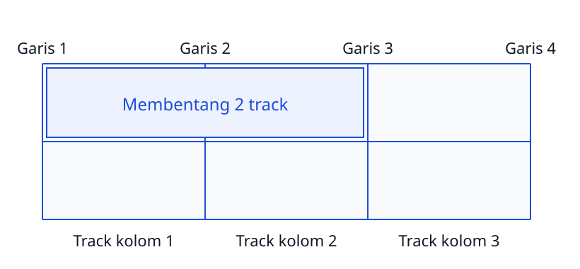

<!-- _class: lead -->
<!-- _paginate: skip -->
<!-- _footer: '' -->

# CSS Grid dan Responsive Web Design

**Bab 7** · Menyusun denah halaman, lalu melipatnya pas layar menyempit

Studi kasus: **dashboard admin Tokosaya**

<!--
Buka dengan pesan pemilik Tokosaya di akhir minggu lalu: dia mau satu ruang kerja
buat melihat kondisi toko sekilas. Tanyakan siapa yang pernah membuka halaman
selebar desktop di HP dan merasa tampilannya berantakan. Sebutkan hasil akhir bab
ini: `admin.html` responsif dan `katalog.html` yang berubah jadi grid kartu.
-->

---

# Tujuan Pembelajaran

Setelah menyelesaikan bab ini, kamu bisa:

- Perbedaan CSS Grid dan Flexbox dan kapan memakai masing-masing
- Kerangka halaman dengan `fr`, `repeat()`, dan `gap`
- Penempatan butir lewat `span` dan `grid-template-areas`
- Strategi mobile-first dengan breakpoint yang konsisten
- Media query, tipografi `clamp()`, dan gambar responsif
- Dashboard admin dan katalog yang responsif serta teruji

<!--
Bacakan tujuan ini singkat saja, lalu kaitkan ke bab sebelumnya. Ingatkan bahwa
Flexbox di Bab 6 tetap dipakai; Grid cuma menambah kemampuan dua dimensi.
Sebutkan bahwa kemampuan di bab ini jadi bekal utama buat UTS di Bab 8, berupa
mini website Tokosaya tiga halaman yang harus responsif.
-->

---

# Dua Permintaan, Dua Masalah

- Pemilik Tokosaya minta satu ruang kerja berisi ringkasan toko
- Rekanmu membuka `katalog.html` dari HP selebar 380 piksel
- Kartu produk tumpang tindih dan teksnya menyempit

| Kebutuhan | Yang menanganinya |
|---|---|
| Menyusun baris dan kolom sekaligus | CSS Grid |
| Halaman tetap layak di berbagai layar | Responsive web design |

> Layout dua dimensi itu soal struktur. Responsif itu soal strategi beradaptasi.

<!--
Ceritakan dua keluhannya berurutan: pesan pemilik toko, lalu rekan yang membuka
katalog dari HP. Tanyakan mana yang masalah dua dimensi dan mana yang masalah
ukuran layar. Jawaban yang diharapkan: dashboard itu wilayah Grid, katalog di HP
itu wilayah media query. Tegaskan bahwa keduanya saling menguatkan, bukan pilihan.
-->

---

<!-- _class: section -->
<!-- _footer: '' -->

# CSS Grid dan Flexbox

## Menata dua arah, bukan cuma satu

<!--
Transisi dari keluhan pemilik toko menuju pertanyaan teknis: sebenarnya Grid itu
apa, dan bedanya dengan Flexbox yang udah dipakai minggu lalu. Tahan dulu soal
propertinya; itu masuk di bagian kedua.
-->

---

# Apa Itu CSS Grid

CSS Grid adalah modul layout yang membagi wadah jadi baris dan kolom sekaligus.

- Wadah grid: elemen yang diberi `display: grid`
- Butir grid: anak-anak di dalam wadah itu
- Kita menentukan denahnya dulu, baru menaruh isinya
- Penempatan butir bisa otomatis, bisa juga manual

> Ibarat denah parkir: garis slotnya dilukis dulu, mobil masuk belakangan.

<!--
Pakai analogi denah parkir buat menjelaskan urutan berpikirnya: denah dulu, isi
kemudian. Ini kebalikan dari cara berpikir Flexbox yang dipakai di Bab 6. Tanyakan
siapa yang sebelumnya menyusun HTML dulu baru bingung mengatur posisinya.
-->

---

<!-- _class: compact -->

# Tiga Istilah di Dalam Grid



- Grid track: satu jalur kolom atau baris
- Sel: perpotongan satu kolom dengan satu baris
- Area: gabungan beberapa sel yang berbentuk persegi

<!--
Tunjuk gambarnya sambil menyebut nomor garis satu per satu: garis 1 sampai garis 4
mengapit tiga track kolom. Tanyakan berapa track yang dilewati butir yang berjalan
dari garis 1 sampai garis 3. Jawaban yang diharapkan: dua track, karena jumlah garis
selalu satu lebih banyak dari jumlah track.
-->

---

# Grid dan Flexbox: Kapan Pakai yang Mana

| Situasi | Pilihan |
|---|---|
| Navigasi horizontal, footer multi kolom | Flexbox |
| Kerangka halaman: header, nav, main, footer | Grid |
| Kartu statistik yang harus sebaris sempurna | Grid |
| Barisan kartu dengan panjang isi berbeda | Flexbox wrap atau Grid |
| Satu elemen digeser sedikit dari alurnya | `position` |

> Flexbox bergerak dari konten menuju layout. Grid bergerak dari denah menuju konten.

<!--
Tekankan dua frasa kunci: content-out lawan layout-out. Tanyakan navigasi Tokosaya
pilih yang mana. Jawaban yang diharapkan: Flexbox, karena cuma satu baris. Lanjutkan
dengan dashboard yang butuh baris dan kolom serentak. Sebutkan juga bahwa di proyek
nyata Grid dipakai buat kerangka, sementara Flexbox menata isi tiap selnya.
-->

---

<!-- _class: section -->
<!-- _footer: '' -->

# Membangun Grid

## Menentukan track dulu, baru menaruh butirnya

<!--
Masuk ke bagian yang paling banyak dipraktikkan: menentukan ukuran track, lalu
menempatkan butirnya. Katakan bahwa bagian ini langsung dipakai di praktikum
dashboard admin.
-->

---

# Menentukan Denah Grid

```css
.kotak-grid {
  display: grid;
  grid-template-columns: repeat(3, 1fr);
  grid-template-rows: repeat(2, 120px);
  gap: 16px;
}
```

`File: latihan-bab7/css/grid-dasar.css`

- Dua properti template menerima daftar ukuran dipisah spasi
- Ukuran boleh `px`, `%`, atau `fr`
- Baris boleh dibiarkan membesar sesuai isi kartu

<!--
Buka file latihannya di layar dan tunjukkan mana kolom dan mana baris. Tanyakan
apa bedanya `grid-template-columns` dan `grid-template-rows` buat mahasiswa yang
masih bingung. Jawaban yang diharapkan: satu menentukan jalur tegak, satu jalur
datar, dan keduanya dipisah spasi. Ingatkan bahwa `repeat(2, 120px)` cuma dipakai
di latihan supaya tingginya gampang diamati.
-->

---

# Satuan fr Membagi Ruang Sisa

`240px 1fr 2fr` berarti satu kolom tetap, lalu sisanya dibagi tiga porsi.

| Bagian | Porsi | Yang didapat |
|---|---|---|
| Kolom 1 | 240 px tetap | lebar kolom navigasi |
| Kolom 2 | 1 porsi | sepertiga dari ruang sisa |
| Kolom 3 | 2 porsi | dua kali lipat kolom 2 |

- `fr` membagi ruang sisa setelah ukuran tetap dan gap dipotong
- Proporsi mengikuti jumlah porsi, bukan jumlah piksel

<!--
Analoginya kayak bagi kue: setelah satu potongan dikhususkan 240 piksel, sisanya
dibagi menurut porsi. Minta mahasiswa menebak lebar tiap kolom kalau wadahnya 1000
piksel dan gap 20 piksel. Jawaban yang diharapkan: 240 tetap, sisa 740 dibagi tiga,
jadi sekitar 247 dan 494 piksel. Tekankan bahwa `fr` nggak peduli ukuran font.
-->

---

# repeat() Menyingkat Penulisan Track

```css
.kotak-grid {
  grid-template-columns: repeat(3, 1fr);
}
```

- Ini bentuk ringkas dari `1fr 1fr 1fr`
- Perulangan bertingkat juga bisa: `repeat(2, 200px 1fr)`
- Hasilnya jadi `200px 1fr 200px 1fr`
- Penulisan ringkas lebih gampang dirawat

<!--
Tunjukkan bahwa `repeat()` bukan fitur wajib, cuma alat biar CSS ringkas. Tanyakan
kenapa penulisan ulang `1fr 1fr 1fr 1fr` di banyak tempat bikin file susah dirawat.
Jawaban yang diharapkan: jumlah kolom harus diubah di banyak titik dan gampang
ketinggalan satu. Perkenalkan juga bahwa `repeat()` bisa memuat lebih dari satu
ukuran per putaran.
-->

---

<!-- _class: compact -->

# gap: Jarak Milik Kerangka

```css
.stat-kartu {
  display: grid;
  grid-template-columns: repeat(4, 1fr);
  gap: 24px;
}
```

- `column-gap` mengatur jarak antar kolom
- `row-gap` mengatur jarak antar baris
- `gap: 16px` menetapkan keduanya sekaligus
- Gap dianggap jarak di dalam kerangka, bukan milik butir
- Jadi nggak perlu trik `:last-child` buat membuang margin ujung

<!--
Tanyakan kenapa `gap` dipilih daripada `margin` pada tiap kartu. Jawaban yang
diharapkan: margin menempel pada butir, jadi kartu pertama dan terakhir butuh
perlakuan khusus. Lanjutkan dengan menunjukkan bahwa dengan `gap` setiap sel punya
hak yang sama. Sebutkan contohnya di kartu statistik: jarak seragam bikin nggak ada
angka yang terkesan lebih penting cuma karena jaraknya lebih lega.
-->

---

<!-- _class: compact -->

# auto-fit dan minmax: Kolom Otomatis

```css
.stat-kartu {
  display: grid;
  grid-template-columns: repeat(auto-fit, minmax(200px, 1fr));
  gap: calc(var(--space-unit) * 3);
}
```

- Browser menaruh kolom selebar mungkin, minimal 200 piksel
- Begitu ruang melebar, kolom baru muncul sendiri
- Di HP menumpuk, di monitor bisa dua sampai empat kolom
- Nggak butuh satu media query pun

<!--
Tanyakan apa arti `auto-fit` dibanding `auto-fill`. Jawaban yang diharapkan:
auto-fit membuang kolom kosong lalu membagikan ruang sisanya ke kartu yang ada.
Sebutkan contoh latihan kartu produk yang memakai `minmax(220px, 1fr)`, jadi HP satu
kolom, 560 piksel dua kolom, dan monitor makin banyak. Ingatkan bahwa pada praktikum
kita justru memilih jumlah kolom eksplisit di dalam media query biar cara berpikir
breakpoint ikut terlatih.
-->

---

<!-- _class: compact -->

# Menempatkan Butir dengan Garis dan span

- `grid-column` dan `grid-row` menyebut garis awal dan garis akhir
- Dari garis kolom 1 sampai garis 3 berarti dua track
- `span` membentang n track tanpa menghitung posisi akhir
- Garis terakhir boleh ditulis sebagai `-1`
- `grid-column: 2 / -1` praktis pas jumlah kolom berubah

```css
.kotak-utama {
  grid-column: 1 / span 2;
  background: var(--clr-primary);
  color: #FFFFFF;
}
```

`File: latihan-bab7/css/grid-dasar.css`

<!--
Minta mahasiswa menuliskan sendiri penempatan buat kartu yang harus membentang
dari garis kolom 1 sampai garis kolom 3. Jawaban yang diharapkan: `grid-column: 1 / 3`
atau `grid-column: 1 / span 2`. Tekankan bahwa `span` lebih aman kalau jumlah kolom
berubah antar perangkat, karena kita nggak perlu menghitung ulang garis akhirnya.
-->

---

<!-- _class: compact -->

# grid-template-areas: Denah dengan Kata

```css
.hlm {
  display: grid;
  grid-template-columns: 240px 1fr;
  grid-template-areas:
    "header header"
    "nav main"
    "footer footer";
}
```

- Tiap baris kata diapit tanda petik
- Jumlah kolom di setiap baris harus sama
- Butir mengambil posisinya lewat `grid-area: header`
- Denah yang berubah cukup digambar ulang di media query

<!--
Tegaskan dua aturan penulisannya: tanda petik dan jumlah kolom yang konsisten. Kalau
salah satu saja dilanggar, browser gagal membentuk denah dan halaman diam-diam balik
ke tumpukan satu kolom. Tanyakan kenapa denah berbasis kata lebih gampang dirawat
daripada menghitung nomor garis. Jawaban yang diharapkan: kita bisa melihat denahnya
langsung di kode, kayak membaca sketsa. Ingatkan bahwa `grid-template-areas` cuma
bisa menggambar bentuk persegi; bentuk tangga pakai garis.
-->

---

<!-- _class: section -->
<!-- _footer: '' -->

# Mobile-First dan Media Query

## Gaya dasar buat HP, lalu naik ke layar lebih besar

<!--
Pindah dari soal menyusun denah menuju soal strategi beradaptasi. Katakan bahwa
bagian ini yang bikin satu halaman yang sama tetap layak dibaca dari HP sampai
monitor kantor.
-->

---

# Kenapa Mobile-First

- Mobile-first: gaya dasar ditulis buat layar kecil dulu
- Strategi ini dipakai industri dan dijelaskan Wroblewski (2012)
- Gaya tambahan ditumpuk buat layar yang makin besar
- Kode bergerak naik, kayak jalan kecil yang diperlebar
- Desktop-first dengan `max-width` memaksa browser membatalkan gaya
- Kaskadenya berubah jadi tempat berburu bug

> Media query dalam pola ini cuma memuat bedanya, jadi pendek-pendek.

<!--
Ingatkan kaskade Bab 3: kalau spesifisitasnya sama, aturan yang ditulis paling
akhir menang. Tanyakan kenapa pola `max-width` bikin kaskadenya susah dilacak.
Jawaban yang diharapkan: gaya desktop harus dibatalkan satu per satu di layar kecil.
Sebutkan bahwa pendekatan ini juga yang dipakai Bootstrap, jadi transisinya mulus.
-->

---

# Breakpoint Konvensi Tokosaya

Breakpoint adalah lebar layar tempat gaya berubah, bukan daftar merek HP.

| Nama | Lebar minimum | Gaya di Tokosaya |
|---|---|---|
| Bawaan | tanpa media query | satu kolom, font dasar |
| `sm` | 576 px | kartu statistik dua kolom |
| `md` | 768 px | panel navigasi geser ke kiri |
| `lg` | 992 px | jarak meluas, sidebar 240 px |
| `xl` | 1200 px | empat kartu sebaris, konten 1200 px |

<!--
Bacakan tabel ini perlahan karena angka ini dipakai sampai Bab 9. Tegaskan pesan
Wroblewski: breakpoint lahir dari konten dan tugas pengguna, bukan dari katalog
merek HP yang tiap tahun berganti. Sebutkan juga baris terakhir konvensi Bootstrap,
`xxl` di 1400 piksel, yang jarang dibutuhkan di proyek sekecil Tokosaya. Tanyakan
pada lebar 820 piksel, media query mana yang sedang berlaku.
-->

---

<!-- _class: compact -->

# Menulis Media Query Menaik

```css
.stat-kartu {
  display: grid;
  grid-template-columns: 1fr;
  gap: calc(var(--space-unit) * 2);
}

/* breakpoint pertama: mulai 576 piksel, kartu dua kolom */
@media (min-width: 576px) {
  .stat-kartu { grid-template-columns: repeat(2, 1fr); }
}
```

- Urutan `min-width` harus menaik: 576, 768, 992, 1200
- Proyek sebesar Tokosaya cukup dua sampai tiga breakpoint
- Tulis satu aturan, lalu uji langsung di browser

<!--
Tanyakan kenapa urutan penulisan media query harus menaik. Jawaban yang diharapkan:
karena kaskade memakai urutan penulisan saat spesifisitasnya sama, jadi blok yang
ditulis terakhir bisa menimpa. Sebutkan bahwa gaya yang nggak disebut ulang di dalam
media query otomatis diwarisi dari gaya dasar, jadi bloknya pendek. Ingatkan untuk
menguji setiap breakpoint tepat setelah menulisnya, bukan setelah semuanya selesai.
-->

---

<!-- _class: compact -->

# clamp(): Huruf yang Bernafas

`clamp()` menerima tiga argumen: nilai minimum, nilai dipilih, dan maksimum.

- Nilai tengah bergerak mengikuti lebar layar
- Ukurannya tetap tertahan di dua batas
- Ibarat termostat: dingin dijaga, panas dijaga

```css
.katalog-judul { font-size: clamp(1.5rem, 1.1rem + 1.5vw, 2rem); }
```

| Lebar layar | Nilai tengah | Yang terpakai |
|---|---|---|
| 375 px | sekitar 23,2 px | minimum 24 px |
| 1440 px | sekitar 39,2 px | maksimum 32 px |

<!--
Kerjakan hitungannya bareng-bareng di papan: 1,1rem itu 17,6 piksel, lalu tambah
1,5vw yang berarti 1,5 persen lebar layar. Tanyakan kenapa hasil di 375 piksel
akhirnya 24 piksel, bukan 23,2 piksel. Jawaban yang diharapkan: nilai tengahnya
jatuh di bawah batas minimum, jadi browser memakai batas minimum. Tekankan bahwa
`clamp()` menggantikan tiga breakpoint untuk tipografi dalam satu baris saja.
-->

---

<!-- _class: compact -->

# Gambar Responsif

```css
.katalog-grid img {
  width: 100%;
  height: auto;
  display: block;
}
```

- `width: 100%` mengikat lebar gambar ke wadahnya
- `height: auto` menjaga proporsi gambar tetap
- `display: block` menghapus celah kecil di bawah gambar
- `object-fit: cover` merapikan potongan gambar berasio lain

<!--
Tanyakan kenapa gambar bawaan menyisakan celah kecil di bawahnya. Jawaban yang
diharapkan: gambar secara bawaan berperilaku inline, jadi menyisakan ruang kayak
huruf. Sebutkan bahwa gambar yang melebihi wadahnya adalah penyebab paling sering
pengguliran horizontal di HP. Ingatkan bahwa `srcset` dan elemen `picture` ditunda
ke Bab 13; di bab ini syarat wajibnya cuma gambar nggak pernah melar.
-->

---

# Dua Pola Layout Responsif

| Pola | Kerangkanya | Catatan |
|---|---|---|
| Dashboard admin | `grid-template-areas` | denah digambar ulang di 768 px |
| Galeri produk: jalan a | jumlah kolom per breakpoint | bisa dijadwalkan bersama desainer |
| Galeri produk: jalan b | `auto-fit` dan `minmax()` | lentur kalau jumlah kartu berubah |

- Pola dashboard: header, sidebar navigasi, dan konten
- Di layar kecil semua area ditumpuk satu kolom
- Yang berubah cuma denahnya, markup tetap sama
- Satu halaman sebaiknya satu pola biar bisa diprediksi

<!--
Bandingkan dua jalan buat galeri produk: pola eksplisit per breakpoint dan pola
otomatis. Tanyakan kapan masing-masing lebih tepat. Jawaban yang diharapkan: pola
eksplisit kalau desain menuntut jumlah kolom pasti, pola otomatis kalau jumlah
kartunya berubah-ubah. Tekankan prinsip paling penting di slide ini: denah milik
wadah, bukan milik tiap kartu, sehingga HTML nggak perlu diubah pas layout bergeser.
-->

---

<!-- _class: section -->
<!-- _footer: '' -->

# Praktik: Dashboard Admin Tokosaya

## Satu denah grid dan beberapa media query menaik

<!--
Masuk ke praktikum. Ingatkan bahwa hasil akhirnya bukan halaman yang cantik,
melainkan dashboard yang tetap terbaca di lima lebar layar. Semua datanya statis
dan tanpa JavaScript, sesuai cakupan mata kuliah.
-->

---

# Tujuan dan Kebutuhan Praktikum

Yang dibangun: **dashboard admin Tokosaya** yang statis dan responsif.

- Header, sidebar navigasi, empat kartu statistik, tabel pesanan
- Kerangka pakai CSS Grid, strategi pakai media query mobile-first
- `katalog.html` juga diubah jadi grid kartu yang responsif
- Semua data contoh statis, tanpa JavaScript dan tanpa server

Siapkan juga:

- Folder `tokosaya-css/` hasil Bab 1 sampai 6 lengkap dengan token
- Dua file baru: `admin.html` dan `css/admin.css`

<!--
Cek satu per satu kelengkapan folder proyeknya sebelum mulai. Kalau token Tokosaya
di `style.css` belum lengkap, suruh mahasiswa melengkapinya dulu karena `admin.css`
memanggil token itu. Ingatkan bahwa urutan `<link>` berpengaruh: `style.css` harus
ditulis sebelum `admin.css`. Sebutkan bahwa data contoh statis ini yang nanti
diujikan di UTS Bab 8.
-->

---

# Langkah Kerja Praktikum

- Tulis kerangka `admin.html`: DOCTYPE, `lang="id"`, meta charset
- Jangan lupa meta viewport, tanpa itu semua media query gagal
- Susun struktur semantik: `.dasbor`, header, nav, main, footer
- Isi tabel pesanan lima baris dengan produk baku Tokosaya
- Susun `css/admin.css` mobile-first: semua area bertumpuk
- Uji di DevTools device toolbar pada 375 sampai 1200 piksel

<!--
Jalankan langkah ini sambil didemokan di layar, jangan cuma dibacakan. Berhenti
agak lama di langkah meta viewport; ini penyebab paling sering media query terasa
nggak bekerja sama sekali di emulasi HP. Ingatkan bahwa urutan `<link>` di `head`
harus `style.css` dulu, baru `admin.css`, biar tokennya terbaca.
-->

---

<!-- _class: compact -->

# Kerangka admin.html

```html
<div class="dasbor">
  <header class="dasbor-header">
    <p class="dasbor-brand">Tokosaya</p>
    <h1 class="dasbor-judul">Dashboard Admin</h1>
  </header>
  <nav class="dasbor-nav" aria-label="Navigasi panel admin">
    <ul>
      <li><a class="dasbor-tautan aktif" href="admin.html" aria-current="page">Dashboard</a></li>
      <li><a class="dasbor-tautan" href="katalog.html">Katalog</a></li>
    </ul>
  </nav>
  <main class="dasbor-main">...</main>
  <footer class="dasbor-footer">...</footer>
</div>
```

`File: tokosaya-css/admin.html`

- Markup cuma punya satu `h1`, yaitu judul dashboard
- Posisi tiap area ditentukan CSS, bukan markup

<!--
Tekankan pembagian tugasnya: HTML memberi nama area, CSS menentukan letaknya.
Tanyakan kenapa markup di sini nggak punya satu pun kelas posisi kayak kiri atau
kanan. Jawaban yang diharapkan: kalau posisi ditulis di markup, halaman nggak bisa
digambar ulang antar breakpoint tanpa mengubah HTML. Sebutkan juga bahwa link aktif
diberi `aria-current="page"` sesuai kebiasaan Bab 2.
-->

---

<!-- _class: compact -->

# Gaya Dasar Denah Dasbor

```css
/* Mobile-first: seluruh area bertumpuk satu kolom */
.dasbor {
  min-height: 100vh;
  display: grid;
  grid-template-columns: 1fr;
  grid-template-areas:
    "header"
    "nav"
    "main"
    "footer";
  background: var(--clr-bg);
  color: var(--clr-body);
  font-family: var(--font-body);
}
```

`File: tokosaya-css/css/admin.css`

- Gaya dasar ini berlaku buat semua layar, termasuk HP
- Nggak ada satu pun media query di sini

<!--
Tanyakan kenapa gaya dasar sengaja ditulis tanpa media query. Jawaban yang
diharapkan: karena semua layar harus dapat sesuatu yang masuk akal lebih dulu, baru
dinaikkan. Tegaskan bahwa tumpukan satu kolom itu bukan versi darurat, tapi memang
keputusan sadar buat layar kecil. Ingatkan bahwa blok ini jadi fondasi yang nggak
pernah dibatalkan media query berikutnya.
-->

---

<!-- _class: compact -->

# Media Query yang Menaik

```css
/* sm: kartu statistik dua kolom */
@media (min-width: 576px) {
  .stat-kartu { grid-template-columns: repeat(2, 1fr); }
}
/* md: sidebar bergeser ke kolom kiri */
@media (min-width: 768px) {
  .dasbor {
    grid-template-columns: 220px 1fr;
    grid-template-areas:
      "header header"
      "nav main"
      "footer footer";
  }
}
```

- Di 992 px sidebar melebar jadi 240 px
- Di 1200 px empat kartu sebaris, konten maksimum 1200 px
- Markup nggak tersentuh sejak langkah pertama

<!--
Bandingkan dua blok denah ini berdampingan di layar: yang dasar satu kolom, yang 768
piksel dua kolom. Tanyakan apa yang sebenarnya berubah. Jawaban yang diharapkan:
cuma string denahnya, sementara nilai `grid-area` di tiap elemen tetap sama. Kalau
sidebar nggak mau bergeser, curigai jumlah kolom tiap baris denahnya nggak
konsisten.
-->

---

<!-- _class: compact -->

# Katalog Responsif

```css
.katalog-grid {
  display: grid;
  grid-template-columns: 1fr;
  gap: calc(var(--space-unit) * 3);
}
@media (min-width: 576px) {
  .katalog-grid { grid-template-columns: repeat(2, 1fr); }
}
@media (min-width: 992px) {
  .katalog-grid { grid-template-columns: repeat(3, 1fr); }
}
@media (min-width: 1200px) {
  .katalog-grid { grid-template-columns: repeat(4, 1fr); }
}
```

- Satu kolom dasar, lalu dua, tiga, dan empat kolom
- Kartu tetap `produk-card` dari Bab 5 dan 6
- Di 1200 px grid jadi empat kolom dua baris

<!--
Tunjukkan bahwa perubahannya pada `katalog.html` cuma satu baris: wadah daftar
produk diberi kelas grid. Tanyakan kenapa kartunya nggak perlu diberi kelas kolom.
Jawaban yang diharapkan: denah milik wadah, jadi jumlah kolom cukup diatur sekali.
Sebutkan bahwa blok ini sengaja diletakkan di akhir `style.css` biar kaskadenya
jelas.
-->

---

<!-- _class: compact -->

# Tabel yang Menggulir di Dalam Wadah

```css
.tabel-scroll {
  overflow-x: auto;
}
.tabel-scroll table {
  width: 100%;
  min-width: 640px;
  border-collapse: collapse;
}
```

- Tabel data butuh lebar minimum buat keterbacaan kolom
- Di HP tabel menggulir di dalam wadahnya sendiri
- Halaman nggak boleh ikut tergeser ke samping
- Pengguliran seluruh halaman itu cacat responsif paling tampak

<!--
Tunjukkan bedanya pengguliran di dalam wadah tabel dan pengguliran pada seluruh
halaman; yang kedua itu cacat, bukan solusi. Tanyakan apa yang terjadi kalau tabel
dibiarkan selebar 640 piksel tanpa wadah penggulir. Jawaban yang diharapkan: tabel
mendorong seluruh halaman melebar dan sisi kanan terpotong. Ingatkan juga supaya
`overflow-y: hidden` nggak ikut tertulis karena bisa menyekat isinya.
-->

---

# Hasil yang Diharapkan

- 375 px: area bertumpuk, kartu satu kolom, tabel menggulir
- 576 px: kartu statistik jadi dua kolom, area lain tetap
- 768 px: navigasi geser ke kolom kiri selebar 220 piksel
- 992 px: kolom navigasi 240 piksel, jarak kartu membesar
- 1200 px: empat kartu sebaris, konten terpusat maksimal 1200 piksel
- Katalog tampil empat kolom dua baris di 1200 piksel

<!--
Bandingkan tampilan sebelum dan sesudah langsung di browser, jangan cuma menampilkan
slide ini. Minta mahasiswa mencatat pengamatan sendiri di tiap lebar uji karena itu
bagian dari laporan tugas. Tekankan tiga kebiasaan penutup: uji dengan melewati
breakpoint, cek pengguliran horizontal, dan sadari bahwa emulasi nggak menggantikan
uji di perangkat sungguhan. Pengujian menyeluruh dibahas lagi di Bab 13 dan Bab 15.
-->

---

# Studi Kasus: Breakpoint RS Sumber Sehat

Rumah sakit daerah menata informasi di meja pendaftaran, saat visum, dan pas jaga malam.

| Titik pakai | Tugas utamanya | Kebutuhannya |
|---|---|---|
| Meja pendaftaran | tabel antrean lebar | tabulasi penuh |
| Kunjungan visum | status kamar sambil bergerak | kartu besar, target sentuh besar |
| Petugas malam | cek antrean ICU dari HP | satu angka besar |

- Tim memilih dua breakpoint: 768 piksel dan 992 piksel
- 576 piksel sengaja dilewati karena datanya angka ringkasan

> Breakpoint itu keputusan rancangan informasi, bukan keputusan teknis semata.

<!--
Ceritakan kisahnya dulu: tiga titik pakai, tiga tugas yang beda, dan satu keputusan
breakpoint yang harus melayani semuanya. Tanyakan kenapa tim melewatkan 576 piksel
padahal Tokosaya memakainya. Jawaban yang diharapkan: karena jenis datanya beda,
isinya angka ringkasan yang udah dibantu `clamp()`. Tutup dengan pelajaran utama:
mulai dari tugas pengguna, tulis denah gridnya, baru pilih `min-width`.
-->

---

# Latihan

- Jelaskan beda layout satu dimensi dan dua dimensi dengan satu contoh
- Tulis satu baris `grid-template-columns`: navigasi 220 piksel plus konten
- Buat `.kotak-grafik` tiga kartu, kartu pertama membentang dua kolom
- Rancang grid jadwal kuliah 4 kolom x 3 baris
- Ubah pola `max-width: 991px` di buku jadi mobile-first pakai `min-width`
- Hitung `font-size: clamp(1.5rem, 1rem + 2vw, 2.5rem)`

> Tuliskan langkah hitungnya, bukan cuma hasil akhirnya.

<!--
Kerjakan butir kedua bareng-bareng di papan, sisanya buat latihan mandiri.
Perhatikan butir terakhir: yang dinilai langkah hitungnya, bukan angka akhirnya.
Tanyakan kapan argumen minimum atau maksimum yang menang pada `clamp()`. Jawaban
yang diharapkan: pas nilai tengahnya jatuh di luar dua batas itu. Ingatkan juga
bahwa butir kelima cuma menukar arah query, bukan menukar isinya.
-->

---

# Cek Daftar Dashboard Responsif

- Media query pakai `min-width` dengan urutan menaik
- Meta viewport tertulis di `head` setiap halaman baru
- Nggak ada pengguliran horizontal di seluruh halaman
- Link navigasi punya area sentuh paling kurang 40 piksel
- Nggak ada nilai warna yang diketik manual, semua pakai token
- Komentar CSS berbahasa Indonesia menandai setiap bagian

<!--
Minta mahasiswa saling memeriksa file pakai daftar ini dan menunjukkan buktinya
langsung di kode, bukan cuma menjawab sudah. Tanyakan bagian mana yang paling sering
gagal. Jawaban yang diharapkan: pengguliran horizontal dan meta viewport yang
kelepasan. Sebutkan bahwa daftar ini juga jadi prasyarat UTS di Bab 8, jadi jangan
ditunda sampai malam sebelum ujian.
-->

---

# Rangkuman

- CSS Grid menata dua dimensi; Flexbox tetap andal satu arah
- `fr`, `repeat()`, dan `gap` menyusun track dan jaraknya
- `span` dan `grid-template-areas` menempatkan serta membentangkan butir
- Mobile-first naik dengan `min-width` menaik; breakpoint lahir dari konten
- `clamp()` mengendalikan tipografi, aturan persen menjaga gambar
- Dashboard admin Tokosaya tetap statis dan tanpa JavaScript

<!--
Tutup dengan pesan utama: denah milik wadah, bukan milik tiap butir, dan strategi
mobile-first bikin kaskadenya tumbuh bukan bertabrakan. Sebutkan bahwa pengujian
lewat device toolbar adalah penutup alur kerja yang nggak boleh dilewatkan. Jembatan
ke Bab 8: semua senjata UTS udah lengkap, dari HTML semantik sampai grid responsif.
-->

---

<!-- _class: lead -->
<!-- _footer: '' -->

# Tugas dan Refleksi

Tambahkan seksi **Agenda Gudang** berisi tiga kartu ke `admin.html`, dengan kartu pertama membentang dua kolom di atas 768 piksel.

**Pertanyaan refleksi:** bagian mana dari proyekmu yang sebenarnya persoalan dua dimensi, tapi masih ditangani Flexbox?

<!--
Tugas individu: kumpulkan `admin.html`, `css/admin.css` terbaru, dan laporan
maksimal 200 kata berisi tiga tangkapan layar pada 375, 768, dan 1200 piksel plus
satu kalimat keterangan per ukuran. Nilai media query yang bertanda `min-width`,
ketiadaan pengguliran horizontal, komentar CSS berbahasa Indonesia, dan pemakaian
token tanpa nilai warna yang diketik manual. Ingatkan bahwa tugas ini juga latihan
langsung buat UTS.
-->
