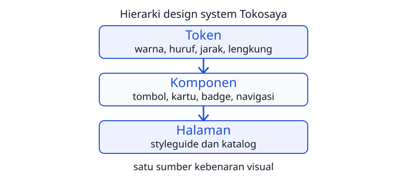

<!-- _class: lead -->
<!-- _paginate: skip -->
<!-- _footer: '' -->

# UI/UX dan Design System

**Bab 12** · Menyusun aturan visual yang tertulis

Studi kasus: **Tokosaya**

<!--
Buka dengan pertanyaan dari apersepsi: kalau Bootstrap di Bab 9 sampai 11 udah kamu
pakai, kenapa halaman Tim Tokosaya masih bisa terasa beda-beda? Ingatkan bahwa bab ini
bukan soal menambah komponen baru, tapi soal menuliskan aturan visualnya biar semua
halaman lahir seragam. Sebutkan hasil akhirnya: satu halaman `styleguide.html`.
-->

---

# Tujuan Pembelajaran

Setelah menyelesaikan bab ini, kamu bisa:

- Prinsip dasar UI: hierarki, konsistensi, usability, affordance
- Dua hukum gestalt dan alasan di baliknya
- Whitespace, alignment, contrast, dan repetition pada contoh halaman
- Arti design system dan manfaatnya buat tim
- Sistem warna, tipografi, dan jarak sebagai token semantik
- Perbandingan antarmuka buruk dan baik lewat matriks varian

<!--
Bacakan tujuan ini singkat saja, lalu hubungkan ke CPMK 7: menerapkan prinsip dasar
UI/UX dan menyusun mini design system. Sebutkan alur babnya biar kamu tahu ke mana dek
ini berjalan: kenapa desain terasa baik, alat apa yang menegakkannya, lalu bagaimana semuanya didokumentasikan. Tahan
dulu istilah token semantik; itu masuk di bagian ketiga.
-->

---

<!-- _class: compact -->

# Saat Aturan Visual Cuma Ada di Kepala Orang

Tokosaya sejak 2019 dikerjakan dua orang, jadi tampilannya otomatis seragam.

- Rara merekrut dua desainer lepas dan satu penulis konten
- Dalam dua minggu, tombol indigo berubah jadi tiga warna
- Lengkung sudut tombol: 12, 4, dan 20 piksel
- Jarak antarkartu katalog berbeda di tiap baris

> "Apakah tombol berwarna jingga itu tombol resmi? Saya takut salah klik pada website palsu."

<!--
Ceritakan masalah Rara sebagai masalah kesepakatan, bukan masalah kemampuan. Tanyakan
siapa yang salah menurut kamu di kasus ini: desainer lepasnya, Rara, atau sistemnya. Jawaban yang
diharapkan: nggak ada aturan tertulis, jadi setiap orang menafsir ulang. Hubungkan
keraguan pembeli dengan konsistensi: keraguan visual langsung mengikis kepercayaan.
-->

---

<!-- _class: section -->
<!-- _footer: '' -->

# Prinsip Dasar UI

## Kenapa satu halaman terasa rapi dan yang lain berantakan

<!--
Peralihan dari kisah Rara menuju pertanyaan dasarnya: apa yang membuat satu antarmuka
terasa baik. Ingatkan bahwa bagian ini menyiapkan kacamata penilaian, bukan daftar
selera. Semua istilah di bagian ini akan muncul lagi pas meninjau styleguide.
-->

---

# UI dan UX

- UI: seluruh wajah visual yang dilihat dan disentuh pengguna
- Layout, warna, huruf, tombol, sampai ikon navigasi
- UX: seluruh rasa dan hasil selama memakai halaman
- Mulai dari membuka halaman sampai selesai berbelanja
- Analogi restoran: UI suasananya, UX pengalaman makannya
- Keduanya menentukan apakah sistem benar-benar dipakai

<!--
Bedakan dua istilah ini pelan-pelan karena sering tertukar; kalau ada koneksi, bandingkan
dua portal kampus di browser biar bedanya terasa. Tanyakan: warna tombol itu
UI atau UX? Jawaban yang diharapkan: UI, sedangkan "saya percaya website ini" adalah UX.
Tekankan bahwa di proyek sistem informasi, keduanya menentukan apakah portal benar-benar
dipakai orang, bukan cuma selesai dibangun.
-->

---

<!-- _class: compact -->

# Hierarki Visual

Pengguna memindai layar dalam hitungan detik, bukan membaca kata demi kata.

```text
TANPA HIERARKI (buruk):
  BELANJA TEPAT KIRIM CEPAT   LIHAT KATALOG klik promo
  Rp diskon  keranjang  kontak  tentang
  -> semua teks sama besar, mata tidak tahu tumpuannya

DENGAN HIERARKI (baik):
  Peralatan Kerja Digital untuk Semua     -> judul besar
  Keyboard, mouse, hingga monitor         -> subjudul kecil
  [ Lihat Katalog ]                       -> tombol indigo
  -> satu tumpuan besar, penjelas di bawah
```

- Pegasnya: ukuran, ketebalan, warna, posisi, dan jarak
- Satu pegas biasanya nggak cukup

<!--
Bandingkan dua versi hero di layar, bukan cuma dibacakan. Tanyakan ke mana matamu
bergerak duluan di versi buruk; jawabannya biasanya ke tombol promo kecil
yang justru bukan aksi utama. Tekankan bahwa hierarki mengarahkan pemindaian, dan
bahwa satu pegas kayak ukuran saja biasanya belum cukup.
-->

---

# Konsistensi

- Elemen yang mirip tampil dan bekerja dengan cara yang mirip
- Tombol utama selalu indigo `--clr-primary`
- Kartu produk selalu berlengkung 12 piksel
- Link aktif di navigasi selalu ditebalkan
- Pengguna belajar sekali, lalu bisa mengulanginya
- Perilaku seragam bikin organisasi terasa rapi

<!--
Pakai contoh dua fakultas yang menamai menu akademik dengan label berbeda; mahasiswa
baru akan tersesat padahal sistemnya sama. Tanyakan kenapa konsistensi bukan cuma
soal tampilan. Jawaban yang diharapkan: perilaku yang seragam memberi kesan bahwa
organisasinya terkelola.
-->

---

# Usability

- Sejauh mana antarmuka membantu pengguna mencapai tujuan
- Efektif, efisien, dan memuaskan
- Ukurannya pertanyaan Steve Krug: pengguna harus berpikir keras?
- "Klik di sini" memaksa pengguna mencari konteks
- "Lihat Katalog" langsung menyampaikan tujuan
- Masalah terbesar ada di halaman rumit dan menegangkan

<!--
Tanyakan label tombol mana yang lebih baik dan kenapa. Jawaban yang diharapkan:
"Lihat Katalog" karena tujuan sudah terbaca sebelum diklik. Sebutkan bahwa di proyek
nyata masalah usability biasanya muncul di halaman penting yang rumit: formulir
pendaftaran, antrean layanan, atau keranjang checkout.
-->

---

# Affordance

- Istilah Don Norman buat isyarat cara berinteraksi
- Gagang pintu terasa bisa ditarik, tombol gerbang bisa ditekan
- Tombol berlatar dan berlengkung terasa bisa ditekan
- Teks indigo terasa bisa disentuh sebagai link
- Teks putih polos tanpa batas bikin pengguna ragu

<!--
Minta mahasiswa menyebut benda di ruang kelas yang affordancenya jelas, lalu pindahkan
analoginya ke layar. Tanyakan apa yang terjadi kalau tombol utama ditampilkan sebagai
teks polos. Jawaban yang diharapkan: pengguna ragu mengklik, dan keraguan itu melebar
jadi rasa nggak percaya pada layanannya.
-->

---

<!-- _class: compact -->

# Dua Hukum Gestalt

- Kedekatan: elemen berdempel dibaca sebagai satu kelompok
- Kemiripan: elemen serupa dibaca sebagai satu rumpun

```text
SALAH BAGI (semua jarak 8 piksel, kelompok samar):
  Nama Lengkap   [__________________]
  Email          [__________________]
  Kota           [________]
  Pesan          [______________________]

BENAR BAGI (dua kelompok jelas):
  -- Identitas --            jarak 8 piksel di dalam kelompok
  Nama Lengkap   [__________________]
  Email          [__________________]

  -- Pengiriman --           jarak 24-32 piksel antar kelompok
  Kota           [________]
```

<!--
Tunjukkan bahwa label dan kolomnya adalah satu pasangan, sedangkan kelompok identitas
dan pengiriman adalah dua kumpulan berbeda. Tanyakan apa yang berubah kalau semua
jarak disamakan 8 piksel. Jawaban yang diharapkan: kelompoknya jadi samar dan mata
harus bekerja lebih keras. Ingatkan bahwa dua hukum ini yang akan kamu pakai sebagai
dasar sistem jarak di bagian berikutnya.
-->

---

<!-- _class: section -->
<!-- _footer: '' -->

# Empat Alat Visual

## Whitespace, alignment, contrast, repetition

<!--
Transisi dari "kenapa harus tertata" ke "alat apa yang dipakai buat menertibkan".
Ingatkan bahwa keempat alat ini nggak butuh bahasa pemrograman; semuanya keputusan
layout yang nanti diterjemahkan jadi token dan kelas Bootstrap.
-->

---

<!-- _class: compact -->

# Whitespace Bukan Ruang Terbuang

Tiga tugas ruang kosong: napas, batas kelompok, dan fokus.

```text
TAK BERNAFAS (jarak 0, semua nempel):
  Monitor IPS 24" MR-241
  LayarBest Seller
  Rp1.899.000[Tambah ke Keranjang][Detail]

BERNAFAS (padding kartu 16-24 piksel):
  Badge Best Seller        (ikon)
  Monitor IPS 24" MR-241
  Monitor IPS 24 inci full HD yang jernih
  Rp1.899.000
  [Tambah ke Keranjang]  [Detail]
```

- Jarak antarbagian kartu 8 sampai 16 piksel
- Ruang kosong memandu mata, bukan ruang sia-sia

<!--
Tangkap reaksi awam dulu: masih ada ruang kosong, berarti harus diisi. Tanyakan bagian
kartu mana yang jadi lebih mudah dibaca setelah diberi napas. Jawaban yang diharapkan:
badge, judul, harga, dan tombol terbaca sebagai empat kelompok terpisah. Sebutkan
angka 16-24 piksel sebagai contoh konkret, bukan angka keramat.
-->

---

# Alignment

- Menempatkan elemen pada garis tak terlihat yang sama
- Teks kartu mulai dari garis vertikal yang sama
- Pemindaian naik-turun jadi lebih cepat
- Paragraf panjang rata kiri, rata tengah buat elemen tunggal
- Jangan mencampur terlalu banyak perataan dalam satu kolom
- Bootstrap menyediakan `text-start` dan `text-center`

<!--
Tekankan bahwa garisnya nggak digambar, tapi mata tetap menangkapnya lewat tepi kartu
yang sejajar. Tanyakan kenapa rata tengah berbahaya buat paragraf panjang. Jawaban
yang diharapkan: tepi kiri yang bergerigi bikin mata sulit menemukan awal baris
berikutnya. Sebutkan bahwa kelas Bootstrap cuma alat; disiplin yang menentukan.
-->

---

# Contrast

- Perbedaan mencolok antara elemen yang harus dibedakan
- Bisa dari warna, ukuran, atau bobot huruf
- Teks `--clr-body` di kartu putih tetap nyaman dibaca
- Judul 32 piksel dibanding keterangan 14 piksel
- Bukan halaman penuh warna-warni
- Kalau semua kontras, nggak ada yang benar-benar kontras

<!--
Koreksi dulu anggapan bahwa contrast berarti halaman berwarna-warni. Tanyakan kenapa
menyamakan semua warna justru menghapus hierarki. Jawaban yang diharapkan: nggak ada
lagi yang menonjol, jadi mata nggak tahu harus mulai dari mana. Sebutkan bahwa ambang
kontras teks akan diuji lebih jauh di Bab 13.
-->

---

# Repetition

- Pengulangan wujud serupa bikin pola cepat terbentuk
- Delapan kartu katalog memakai kelas `p-kartu` yang sama
- Bilah header sama bentuknya di semua halaman
- Badge status selalu kapsul kecil di pojok kiri atas
- Empat alat saling mengunci: grid, jarak, fokus, pola

<!--
Tunjukkan bahwa repetition yang mengubah halaman beragam jadi satu bahasa. Tanyakan
apa yang terjadi kalau satu kartu dibuat dengan wujud baru tanpa alasan. Jawaban yang
diharapkan: diam-diam ada komponen baru yang harus dirawat. Tutup bagian ini dengan
menegaskan bahwa keempat alat inilah yang nanti jadi token dan kelas.
-->

---

<!-- _class: section -->
<!-- _footer: '' -->

# Design System dan Token

## Satu sumber kebenaran visual proyek

<!--
Peralihan dari alat visual menuju bangunan yang menyimpan semua keputusan visual.
Sebutkan bahwa bagian ini yang menjawab pertanyaan Rara
di awal bab: aturan tertulis yang bisa dibuka siapa pun.
-->

---

# Apa Itu Design System

- Kumpulan standar: token, komponen, pola, aturan, dokumentasi
- Frasa kuncinya: satu sumber kebenaran
- Keputusan visual tinggal di satu tempat, bukan di kepala orang
- Analoginya stylebook kantor berita atau buku resep jaringan kafe
- Bedakan dari design token: token itu lantai dasarnya

<!--
Kembali ke analogi buku resep: tanpa resep, tiap cabang kafe punya rasa sendiri dan
mereknya pecah. Tanyakan apa bedanya design system dan design token. Jawaban yang
diharapkan: token itu satu lapisan, design system itu bangunannya. Ingatkan juga bahwa
Bootstrap yang kamu pakai sejak Bab 9 sebenarnya design system publik.
-->

---

# Empat Lapisan Design System

Setiap lapisan dipakai lapisan di atasnya.



<!--
Bacakan diagramnya dari atas ke bawah biar kamu lihat cara kerjanya: token menyediakan
nilai, komponen mengonsumsi nilai itu, halaman mengonsumsi komponen, dan pengguna
akhirnya melihat halamannya.
Tanyakan apa yang terjadi kalau `--clr-primary` diubah. Jawaban yang diharapkan:
tombol, badge, dan link di semua halaman ikut berubah tanpa menyentuh halaman satu
per satu. Sebutkan bahwa dua lapisan sisanya, pola dan dokumentasi, dibahas berikutnya.
-->

---

# Lima Manfaat Design System

- Konsistensi: semua halaman lahir dari token yang sama
- Kecepatan: tim menyalin pola, nggak mulai dari nol
- Pemeliharaan: ganti satu token, semua halaman ikut berubah
- Komunikasi: satu kosakata buat menyebut komponen
- Adaptasi: anggota baru cukup membaca satu halaman
- Contoh nyata: Material Design dan Bootstrap

<!--
Kaitkan tiap manfaat dengan keluhan di apersepsi supaya nggak terasa hafalan. Tanyakan
manfaat mana yang paling terasa buat tim kecil kayak Tokosaya. Jawaban yang diharapkan:
kecepatan dan adaptasi, karena anggota baru bisa langsung menyalin pola. Sebutkan
bahwa design system Tokosaya memang mini, tapi susunannya sama kayak yang dipakai
tim industri.
-->

---

# Token Primitif dan Token Semantik

- Primitif menyebut nilai tanpa konteks: "indigo 600"
- Semantik menyebut peran: `--clr-danger` buat pesan bahaya
- Peran lebih stabil daripada nilai
- Merek boleh berganti, makna "bahaya" tetap sama
- Token ditulis sekali di `:root`, lalu dikonsumsi `var()`
- Nilai mentah `#4F46E5` di halaman bikin sistem bocor

<!--
Ini slide terpenting di bagian token; pelankan penyampaiannya. Tanyakan kenapa token
semantik lebih tahan lama daripada token primitif. Jawaban yang diharapkan: karena
peran nggak ikut berubah pas nilainya diganti. Tekankan disiplin `var()`: kalau satu
halaman menulis nilai mentah, perubahan warna utama nanti cuma kena sebagian tombol.
-->

---

# Token Warna Inti

Setiap baris jadi kartu warna bernama di styleguide.

| Token | Nilai | Peran semantik |
|---|---|---|
| `--clr-primary` | `#4F46E5` | tombol utama, link, aksi penting |
| `--clr-primary-dark` | `#4338CA` | tombol pas disentuh |
| `--clr-accent` | `#F59E0B` | badge penanda dan sorotan |
| `--clr-dark` | `#1E293B` | judul dan teks yang tegas |
| `--clr-body` | `#334155` | teks paragraf utama |

<!--
Buka tabel ini di browser sambil menunjuk tombol Tokosaya yang memakainya. Tanyakan
token mana yang cocok buat teks judul dan kenapa. Jawaban yang diharapkan:
`--clr-dark`, karena perannya menuntut bobot paling tegas. Ingatkan bahwa nama token
menyebut fungsi, bukan warna, jadi gampang dibaca anggota tim baru.
-->

---

# Token Warna Latar dan Status

| Token | Nilai | Peran semantik |
|---|---|---|
| `--clr-bg` | `#F8FAFC` | latar halaman |
| `--clr-surface` | `#FFFFFF` | latar kartu dan panel |
| `--clr-border` | `#E2E8F0` | garis pembatas kartu dan input |
| `--clr-success` | `#16A34A` | pesan sukses, badge "Tersedia" |
| `--clr-danger` | `#DC2626` | pesan bahaya, badge "Stok Terbatas" |

- Indigo dipilih karena diasosiasikan dengan teknologi
- Cukup gelap buat teks putih, beda dari biru Bootstrap

<!--
Tanyakan kenapa kartu warna `--clr-surface` perlu garis tepi di styleguide. Jawaban
yang diharapkan: putih di atas putih menyatu, jadi butuh `--clr-border` biar terlihat.
Tekankan juga soal indigo: pilihan warna di sini punya alasan teknis, bukan cuma
selera, karena teks putih di atasnya harus tetap nyaman dibaca.
-->

---

<!-- _class: compact -->

# Do dan Don't Warna

- Do: satu warna utama buat semua aksi penting
- Do: hijau sukses, merah bahaya, kuning sorotan
- Do: catat pasangan warna dan teks di styleguide
- Don't: bikin merah kedua yang mirip
- Don't: pakai warna sebagai satu-satunya penyampai makna
- Don't: tulis nilai mentah di luar `:root`

> Aturan yang sama berlaku buat tint: `rgba(22, 163, 74, 0.1)` memancarkan `--clr-success` tanpa warna baru.

<!--
Minta mahasiswa menebak mana yang paling sering dilanggar di latihan mereka; biasanya
memakai nilai mentah. Tanyakan kenapa warna nggak boleh jadi satu-satunya penyampai
makna. Jawaban yang diharapkan: pengguna dengan penglihatan warna terbatas akan
kehilangan maknanya, jadi ikon atau teks harus ikut menjelaskan. Sebutkan bahwa tint
adalah cara menambah latar tipis tanpa menambah warna ke sistem.
-->

---

# Sistem Tipografi

Dua keluarga huruf, dua peran.

| Peran di Tokosaya | Elemen/kelas | Huruf dan bobot |
|---|---|---|
| Judul hero | `h1` | Poppins 700 |
| Judul halaman | `h2` | Poppins 600 |
| Judul kartu | `h3`/`h5` | Poppins 600 |
| Subjudul | `.lead` | Inter 400 |
| Teks paragraf | `body` | Inter 400 |

- Poppins berbicara, Inter bercerita
- Pergantian huruf jadi sinyal hierarki

<!--
Tanyakan kenapa judul dan paragraf sengaja memakai keluarga huruf berbeda. Jawaban
yang diharapkan: peran berbeda, suara berbeda, dan pergantiannya sendiri sudah jadi
sinyal hierarki. Sebutkan bahwa Bootstrap menangani ukuran dan jarak, sedangkan file
`css/style.css` menggantungkan keluarga huruf dari token.
-->

---

# Disiplin Tipografi

- Satu `h1` per halaman
- Jenjang heading nggak melompat: h1 ke h2 ke h3
- Panjang baris paragraf 60 sampai 75 karakter
- `line-height` paragraf dibiarkan lega
- Keterangan kecil memakai Inter 500
- Baris terlalu panjang bikin pembaca tersesat

<!--
Hubungkan aturan ini dengan aksesibilitas: alat bantu membaca dokumen dari jenjang
headingnya. Tanyakan kenapa baris yang terlalu panjang melelahkan mata. Jawaban yang
diharapkan: pas kembali ke baris berikutnya, pembaca sering salah baris. Ingatkan
bahwa aturan ini bukan detail sepele, karena nanti diuji lagi di Bab 13.
-->

---

# Sistem Jarak 8 Piksel

| Jarak | Utilitas Bootstrap | Pemakaian lazim |
|---|---|---|
| 8 piksel | `gap-2`, `p-2` | jarak ikon dan teks |
| 16 piksel | `gap-3`, `p-3` | antar baris elemen berpasangan |
| 24 piksel | `gap-4`, `p-4` | antar kartu dalam satu grid |
| 48 piksel | `gap-5`, `p-5` | antar section dalam halaman |
| 64 piksel | utilitas plus CSS kustom | jarak header dan footer |

- Label dan input 8 piksel, antar kelompok 24 piksel
- Skala 8 piksel itu aturan desain, utilitas itu alatnya

<!--
Buka file `index.html` di browser, pilih satu kartu di DevTools, lalu bacakan jaraknya
biar skala ini terasa nyata.
Tanyakan kenapa keputusan jarak dibatasi ke enam nilai saja. Jawaban yang diharapkan:
anggota tim tinggal memilih, bukan menebak dari ratusan kemungkinan. Ingatkan bahwa
nilai 32 piksel bisa didapat dengan menumpuk utilitas atau satu kelas kustom.
-->

---

<!-- _class: section -->
<!-- _footer: '' -->

# Komponen dan Styleguide

## Dari token jadi wajah halaman

<!--
Peralihan dari token menuju komponen yang mengonsumsinya. Ingatkan urutannya: token
dulu, komponen menyusul, halaman terakhir. Bagian ini ditutup dengan styleguide yang
menampilkan semuanya dalam satu halaman.
-->

---

# Komponen dan Matriks Varian

Komponen: unit antarmuka yang diulang. Varian: wujud bakunya.

| Jenis \ Status | Normal | Hover | Nonaktif |
|---|---|---|---|
| **Utama** `.btn-utama` | indigo, teks putih | indigo gelap | redup |
| **Outline** `.btn-outline-toko` | garis indigo | latar indigo | garis tipis |
| **Netral** `.btn-netral` | putih, garis abu | garis indigo | garis tipis |

- Utama buat satu tindakan paling bernilai di layar
- Varian di luar matriks nggak boleh lolos ke produksi

<!--
Tanyakan kenapa matriks varian ditulis, padahal tombolnya cuma satu komponen. Jawaban
yang diharapkan: biar varian aneh bisa dikenali sejak awal dan nggak lolos ke produksi
tanpa alasan. Sebutkan aturan pemakaiannya: utama buat aksi paling bernilai, outline
urutan kedua, netral buat tindakan pendamping.
-->

---

# Kartu Produk

- Enam bagian tetap, urutannya nggak boleh berubah
- Badge status, ikon, judul, keterangan, harga, dan aksi
- Varian dibedakan lewat isi, bukan lewat wajah
- Kartu Best Seller dan Stok Terbatas berbagi kelas `p-kartu`
- Lengkung dan bayangan datang dari token `--radius`
- Pengguna memindai katalog secepat melihat rak minuman

<!--
Tekankan urutan bagian kartu: badge, ikon, judul, keterangan, harga, aksi. Tanyakan
kenapa kartu Best Seller dan Stok Terbatas tetap satu kelas. Jawaban yang diharapkan:
yang berubah cuma badge-nya, jadi kalau wajahnya dibuat beda berarti diam-diam lahir
komponen baru tanpa alasan.
-->

---

# Badge Ikut Punya Aturan

| Badge dataset | Token | Makna yang disampaikan |
|---|---|---|
| Best Seller | `--clr-accent` | produk terlaris |
| Tersedia | `--clr-success` | stok aman |
| Stok Terbatas | `--clr-danger` | urgensi |
| Baru | `--clr-primary` | masuk katalog terbaru |

- Warna bukan satu-satunya penyampai makna, jadi sertakan teks
- Setiap badge dataset punya satu token tetap

<!--
Bandingkan badge dengan aturan warna tadi: maknanya harus terbaca walau warnanya susah
dibedakan. Tanyakan apa tugas teks di dalam badge. Jawaban yang diharapkan: menjelaskan
makna yang nggak boleh cuma bergantung pada warna. Ingatkan bahwa badge kecil pun
masuk matriks varian dan harus ada di styleguide.
-->

---

# Navigasi

- Navbar: brand, menu baku, ikon keranjang di kanan
- Menu baku: Beranda, Katalog, Tentang, Kontak
- Breadcrumb buat halaman dalam
- Link aktif ditandai `aria-current="page"`
- Desktop bisa tampil penuh tanpa JavaScript
- Tombol buka-tutup di layar sempit butuh JavaScript Bootstrap

<!--
Jelaskan pembagian tugasnya: bentuk visual navigasi kita kuasai, perilaku interaktifnya
diserahkan ke JavaScript Bootstrap yang memang di luar cakupan mata kuliah ini.
Tanyakan kenapa link halaman aktif perlu ditandai, bukan cuma diwarnai. Jawaban yang
diharapkan: penanda itu dibacakan alat bantu, sedangkan warna cuma terlihat.
-->

---

# Styleguide: Satu Halaman, Semua Token

- Satu halaman, semua token, semua komponen
- Pembukanya: swatch warna bernama beserta nilai heksa
- Sampel tipografi dari H1 sampai teks kecil
- Skala jarak dalam bentuk visual dan catatan do and don't
- Tiga pembaca: desainer, penulis kode, penjaga merek
- Varian baru lahir bersama dokumentasinya di hari yang sama

<!--
Sebutkan tiga pembaca styleguide dan apa yang dicari masing-masing dari file itu.
Tanyakan kenapa
dokumentasi yang nggak bisa dilihat biasanya juga nggak dipatuhi. Jawaban yang
diharapkan: orang mau menyalin dari contoh nyata, bukan dari daftar nama. Tutup dengan
aturan kejujuran sistem: nggak ada varian yang berjalan lebih dulu daripada
dokumentasinya.
-->

---

<!-- _class: compact -->

# Praktikum 1: Token di style.css

```css
:root {
  --clr-primary: #4F46E5;
  --clr-primary-dark: #4338CA;
  --clr-accent: #F59E0B;
  --clr-success: #16A34A;
  --clr-danger: #DC2626;
  --clr-border: #E2E8F0;
  --font-heading: 'Poppins', sans-serif;
  --font-body: 'Inter', sans-serif;
  --radius: 12px;
  --shadow-card: 0 8px 24px rgba(15, 23, 42, 0.08);
  --space-unit: 8px;
}
```

`File: tokosaya-bootstrap/css/style.css`

- Blok token ditaruh di paling atas file
- Token lama dari Bab 4 diganti sekaligus, jangan sampai ganda

<!--
Kerjakan langkah ini bareng-bareng di layar: tempel blok token ke file `css/style.css`,
lalu simpan. Tanyakan
kenapa dua salinan token berbahaya. Jawaban yang diharapkan: nilai ganda bikin
perubahan berikutnya cuma kena sebagian halaman. Tekankan juga bahwa urutan di `head`
menentukan pemenang: `css/style.css` dimuat paling akhir.
-->

---

<!-- _class: compact -->

# Praktikum 2: Sembilan Section Styleguide

```html
<link href="https://cdn.jsdelivr.net/npm/bootstrap@5.3.3/dist/css/bootstrap.min.css" rel="stylesheet">
<link href="https://cdn.jsdelivr.net/npm/bootstrap-icons@1.11.3/font/bootstrap-icons.min.css" rel="stylesheet">
<link href="css/style.css" rel="stylesheet">
```

`File: tokosaya-bootstrap/styleguide.html`

- Satu `h1`: "Styleguide Tokosaya", lalu `h2` per section
- Urutan link: Bootstrap dan ikon dulu, `css/style.css` paling bawah
- Verifikasi: `--clr-primary` tampil indigo, `--clr-accent` amber
- Inspeksi kartu di DevTools: 24 piksel antar kartu, 16 di dalam

<!--
Buka file `styleguide.html` hasil praktikum di browser, jangan cuma memperlihatkan
slide ini.
Tanyakan kenapa halaman tampil polos kalau CDN-nya salah ketik. Jawaban yang
diharapkan: CSS Bootstrap gagal dimuat, jadi gaya kustom yang menumpang di atasnya
ikut hilang. Ingatkan juga pola dua lapis Bootstrap: kelas dasar `btn` plus kelas
varian `btn-utama`.
-->

---

# Latihan

- Amati satu website kampus di browser: cari empat prinsip UI
- Susun matriks varian buat empat badge dataset Tokosaya
- Cari tiga jarak yang menyimpang dari kelipatan 8 piksel
- Rancang token buat "buku tersedia", "dipinjam", "terlambat"
- Tulis styleguide mini proyek toko buku sekolahmu sendiri

> Jelaskan pelanggaran prinsip dan tokennya, bukan selera pribadimu.

<!--
Kerjakan butir pertama bareng-bareng: buka satu portal kampus dan tunjuk cacatnya
berdasarkan istilah bab ini. Ingatkan sumber dayanya: inspektur elemen browser buat
membaca jarak nyata. Tanyakan kenapa argumen "kurang enak dilihat" nggak cukup di
tugas ini; jawabannya karena penilaiannya harus merujuk prinsip atau token.
-->

---

# Cek Daftar styleguide.html

- Satu `h1` dan jenjang heading yang nggak melompat
- Semua warna komponen lewat `var()`, bukan nilai mentah
- Sepuluh swatch token tampil dengan nama dan nilainya
- Skala jarak 8 sampai 64 piksel terlihat panjangnya
- Setiap varian tombol, badge, dan alert ada di halaman
- Label form terhubung `id` dan ikon dekoratif `aria-hidden`

<!--
Minta mahasiswa saling memeriksa file pakai daftar ini dan menunjukkan buktinya
langsung di kode. Tanyakan baris mana yang paling sering gagal; biasanya soal nilai
mentah dan label form. Ingatkan bahwa styleguide ini masih dipakai di Bab 13, 14, dan
15, jadi kerapiannya sekarang menghemat waktu nanti.
-->

---

# Rangkuman

- Hierarki, konsistensi, usability, dan affordance memandu wajah halaman
- Kedekatan dan kemiripan menyederhanakan cara mata membaca
- Whitespace, alignment, contrast, repetition jadi alat kerjanya
- Design system menyatukan token, komponen, aturan, dan dokumentasi
- Token semantik menamai peran, jadi perubahan nilai aman
- Styleguide adalah satu halaman semua token dan komponen

<!--
Tutup dengan pesan utama bab: keputusan visual itu boleh berubah, asal tinggal di satu
tempat yang jelas. Sebutkan bahwa Bab 13 menguji bangunan ini di browser pada dua dimensi baru,
yaitu layar sempit dan aksesibilitas. Tanyakan satu hal yang mau mereka rapikan dulu
di proyek masing-masing.
-->

---

<!-- _class: lead -->
<!-- _footer: '' -->

# Tugas dan Refleksi

Lengkapi `styleguide.html` dengan section 10 berisi lima pasangan Do & Don't warna.

**Pertanyaan refleksi:** siapa yang memelihara styleguide, dan dengan ritme yang kayak apa?

<!--
Tugas individu dikumpulkan sebagai `styleguide.html` yang diperbarui plus catatan
maksimal satu halaman. Nilai kedisiplinan token, alasan yang menyebut contrast atau
kemiripan, dan markup yang tetap semantik: satu `h1`, label terhubung, tanpa gaya
inline. Tugas kelompoknya audit tiga halaman riil dengan styleguide sebagai pembanding,
lalu laporkan temuan dalam tabel beserta token yang seharusnya dipakai.
-->
